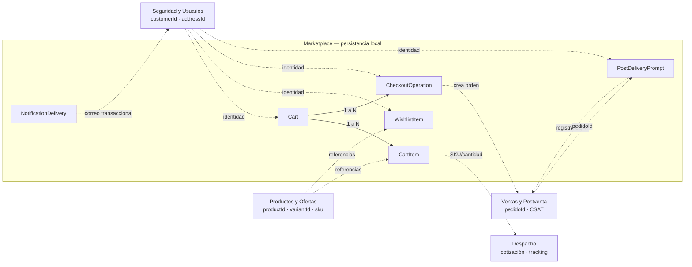

# Modelo lógico inicial de datos — Marketplace

## 1. Objetivo y alcance

Este modelo representa exclusivamente datos que Marketplace necesita controlar para sus 40 funcionalidades: el carrito, favoritos, la protección contra órdenes duplicadas y el estado local de presentación de la encuesta postentrega. No replica clientes, direcciones, productos, inventario, precios, pedidos, despachos ni calificaciones CSAT.

Es un modelo lógico, no un `schema.prisma` ni una migración. Los tipos, índices y nombres físicos se concretarán de manera incremental cuando las specs afectadas estén aprobadas.

## 2. Límites de propiedad

| Dato o entidad | Dueño | Tratamiento en Marketplace |
| --- | --- | --- |
| Cliente, identidad y direcciones guardadas | Seguridad y Usuarios | Se consultan con el token del titular; sólo se usan como referencia o se envía una copia a Ventas al crear el pedido. |
| Producto, variante, SKU, precio, promociones y stock | Productos y Ofertas | Se consultan por API. Marketplace conserva únicamente referencias necesarias para carrito/favoritos y snapshots transitorios de presentación. |
| Pedido y su total histórico | Ventas y Postventa | Se crea y consulta por API; `pedidoId` es una referencia externa. |
| Cotización, despacho y tracking | Despacho y Entrega | Se consultan por API; no se persisten como entidades locales. |
| Calificación CSAT y comentario | Ventas y Postventa | Marketplace muestra el flujo de `F-040`, pero registra la calificación en el endpoint dueño. |
| Carrito, favoritos, operación de checkout y estado de invitación UX | Marketplace | Persistencia local. |

## 3. Identificadores y reglas transversales

| Concepto | Identificador de integración | Decisión |
| --- | --- | --- |
| Cliente | `customerId` / UUID de Seguridad | Referencia externa; no existe tabla local de clientes. |
| Producto | `productId` | Se usa para favoritos y navegación. |
| Variante de catálogo | `variantId` | Identificador interno de Catálogo; puede mostrarse, pero no es la llave de integración de inventario. |
| Unidad comprable e inventario | `sku` | Es la llave intercambiada con Productos y Ofertas, Despacho y Ventas; identifica la línea de carrito. |
| Pedido | `pedidoId` | Identificador externo de Ventas y Postventa. |
| Sesión anónima | secreto aleatorio en cookie segura; hash persistido | Nunca se guarda el secreto en claro. |
| Reintento de checkout | `Idempotency-Key` | Única por cliente y operación; impide duplicar la creación de pedido. |

La decisión anterior que hablaba de `productVariantId` se refina así: la selección de variante se conserva en UI y en Catálogo, pero el **SKU** es la identidad comercial interoperable que Marketplace debe usar para el carrito, disponibilidad, cotización y orden.

## 4. Diagrama lógico

Las líneas discontinuas son referencias e integraciones API; no son claves foráneas entre bases de datos.

## 5. Entidades locales

### 5.1 `Cart`

Representa un carrito activo de visitante o de cliente autenticado.

| Atributo lógico | Regla |
| --- | --- |
| `id` | UUID interno. |
| `customerId` | UUID externo nullable; se usa en carrito autenticado. |
| `anonymousSessionHash` | Hash del secreto de cookie; se usa en carrito anónimo. |
| `state` | `ACTIVE`, `MERGED`, `CHECKED_OUT` o `ABANDONED`. |
| `mergedIntoCartId` | Referencia local nullable al carrito autenticado que recibió sus líneas; obligatoria cuando el estado es `MERGED`. |
| `currency` | `PEN` en la versión inicial. |
| `version` | Entero de concurrencia optimista; aumenta en cada mutación de líneas o fusión. |
| `createdAt`, `updatedAt`, `mergedAt`, `checkedOutAt` | Auditoría del ciclo de vida. |

Restricciones lógicas:

- Un carrito `ACTIVE` pertenece a **un** cliente o a **una** sesión anónima, nunca a ambos.
- Existe como máximo un carrito `ACTIVE` por cliente y uno por sesión anónima.
- Al iniciar sesión, ambos carritos se fusionan de forma transaccional; el carrito anónimo pasa a `MERGED`.
- Un carrito `MERGED` conserva trazabilidad mediante `mergedIntoCartId` y no acepta nuevas mutaciones.
- Una mutación de líneas debe comprobar `version`; ante una actualización concurrente se vuelve a leer el carrito y se aplica la regla de la funcionalidad correspondiente, sin perder cantidades confirmadas.

### 5.2 `CartItem`

Línea comprable de un carrito.

| Atributo lógico | Regla |
| --- | --- |
| `id` | UUID interno. |
| `cartId` | Referencia local a `Cart`. |
| `sku` | Identificador externo obligatorio de la unidad comprable. |
| `productId`, `variantId` | Referencias externas opcionales para navegación y presentación; no sustituyen a `sku`. |
| `quantity` | Entero mayor que cero; se revalida contra inventario en cada operación relevante. |
| `unitPriceSnapshot`, `priceVersion`, `quotedAt` | Snapshot transitorio para mostrar el carrito; no es precio autoritativo y se refresca antes de pagar. |
| `createdAt`, `updatedAt` | Auditoría. |

Restricciones lógicas:

- Unicidad obligatoria por `cartId + sku`.
- No se guarda stock local ni se reserva inventario al agregar al carrito.
- Al fusionar carritos se suman cantidades por SKU; si exceden disponibilidad, se ajusta al máximo confirmado y se informa al cliente.
- La adición, cambio o eliminación de una línea actualiza `Cart.version` en la misma transacción local.

### 5.3 `WishlistItem`

Producto que un cliente autenticado guarda para revisar después.

| Atributo lógico | Regla |
| --- | --- |
| `id` | UUID interno. |
| `customerId` | UUID externo de Seguridad. |
| `productId` | Referencia externa a Productos y Ofertas. |
| `createdAt` | Auditoría. |

Restricciones lógicas:

- Unicidad por `customerId + productId`.
- El favorito es de nivel producto. Si requiere una variante, `F-039` redirige a la ficha para seleccionar el SKU antes de agregar al carrito.
- Sólo se elimina después de confirmar que el ítem se agregó o actualizó correctamente en el carrito.

### 5.4 `CheckoutOperation`

Registro técnico de una confirmación de checkout. No es un pedido ni contiene datos financieros sensibles.

| Atributo lógico | Regla |
| --- | --- |
| `id` | UUID interno. |
| `customerId`, `cartId` | Cliente externo y carrito local de origen. |
| `idempotencyKey` | Valor de `Idempotency-Key` recibido para confirmar la operación. |
| `requestFingerprint` | Hash del contenido relevante de la solicitud; evita reutilizar una clave con otro contenido. |
| `state` | `PREPARING`, `PREPARED`, `SUBMITTED`, `SUCCEEDED` o `FAILED`. `PREPARED` significa que F-025 simuló el pago y revalidó el resumen; no que exista una orden. |
| `externalOrderId` | `pedidoId` devuelto por Ventas, nullable hasta el éxito. |
| `failureCode`, `createdAt`, `completedAt` | Diagnóstico no sensible y auditoría. |

Restricciones lógicas:

- Unicidad por `customerId + idempotencyKey`.
- La misma clave y el mismo fingerprint devuelven el resultado original.
- La misma clave con contenido distinto se rechaza.
- No persiste número de tarjeta, CVV, token de sesión, dirección completa ni respuesta completa de proveedores.
- Dirección elegida, cotización de envío, cupón y resumen son datos transitorios de checkout: viajan en solicitudes o respuestas con vencimiento y se revalidan; no forman entidades locales de Marketplace.

### 5.5 `PostDeliveryPrompt`

Estado de presentación de la propuesta UX `F-040`. No almacena la calificación, motivos ni comentario: esos datos pertenecen a CSAT de Ventas y Postventa.

| Atributo lógico | Regla |
| --- | --- |
| `id` | UUID interno. |
| `customerId`, `externalOrderId` | Referencias externas. |
| `deliveryConfirmedAt` | Hora externa con la que se comprobó la elegibilidad; no sustituye tracking. |
| `state` | `ELIGIBLE`, `SHOWN`, `DISMISSED` o `SUBMITTED`. |
| `eligibleAt`, `shownAt`, `dismissedAt`, `submittedAt` | Auditoría y control UX. |

Restricciones lógicas:

- Un registro por `customerId + externalOrderId`.
- Sólo puede pasar a `ELIGIBLE` después de confirmar estado `ENTREGADO` mediante el contrato de tracking o pedido.
- `SUBMITTED` se establece únicamente tras recibir éxito o conflicto de “ya registrada” desde CSAT.

### 5.6 `NotificationDelivery`

Registro de salida para correos transaccionales de pedido y despacho. No representa el pedido ni almacena una copia completa de su contenido.

| Atributo lógico | Regla |
| --- | --- |
| `id` | UUID interno. |
| `externalOrderId`, `customerId` | Referencias externas del pedido y titular. |
| `type` | `ORDER_CONFIRMATION` o `SHIPMENT_UPDATE`. |
| `eventKey` | Identificador idempotente del hecho que dispara el correo; único junto con `type`. |
| `recipientEmailEncrypted` | Correo cifrado para el envío; nunca se escribe en logs. |
| `payloadVersion`, `state` | Versión de plantilla y `PENDING`, `SENT`, `FAILED` o `SUPPRESSED`. |
| `providerMessageId`, `attemptCount`, `lastAttemptAt`, `sentAt` | Trazabilidad de entrega. |

Restricciones lógicas:

- Un mismo hecho externo no puede generar dos entregas del mismo tipo.
- El envío se encola después de persistir el registro local; sus reintentos no alteran el pedido ni bloquean la respuesta de compra.
- El contenido renderizado y el correo se conservan sólo según la política de retención que el equipo acuerde; no se replica el historial completo del pedido.

## 6. Datos que deliberadamente no se modelan localmente

- `User`, `Address`, credenciales, roles y tokens.
- Sesiones de acceso, refresh tokens, desafíos MFA y solicitudes/tokens de recuperación: pertenecen a Seguridad y Usuarios; no son entidades de Marketplace.
- `Product`, `ProductVariant`, `SKU`, inventario, precio y cupón como tablas propias.
- `Order`, `OrderItem`, `Payment`, `Shipment` o su historial.
- Calificación, motivos y comentario de CSAT.

Esto evita duplicación, inconsistencias y acceso indebido entre módulos. Las specs de cada funcionalidad indicarán el contrato que consulta la información vigente.

## 7. Paso al modelo físico

Una spec puede derivar migración Prisma sólo si confirma: el campo requerido, su dueño, el contrato externo, la validación, la regla de retención y los índices necesarios. El esquema preliminar existente debe actualizarse en ese momento para reemplazar `CartItem.sessionId/customerId` por el agregado `Cart` y para usar `sku` como llave de línea.
