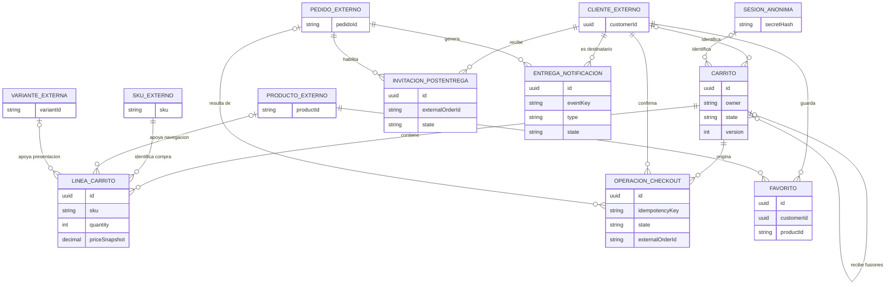

# Diagrama entidad-relación

Esta vista representa conceptos del dominio y sus cardinalidades. Incluye entidades externas para explicar de dónde provienen los identificadores, pero no describe claves foráneas físicas.

## Cómo leerlo

- `CLIENTE_EXTERNO`, `SESION_ANONIMA`, `PRODUCTO_EXTERNO`, `VARIANTE_EXTERNA`, `SKU_EXTERNO` y `PEDIDO_EXTERNO` no son tablas del Marketplace.
- Un carrito tiene exactamente un tipo de propietario: cliente o sesión anónima. El XOR se expresa como regla porque Mermaid no tiene una notación directa para esta exclusión.
- Las asociaciones con entidades externas representan identificadores intercambiados por API.
- La única relación recursiva es la trazabilidad de un carrito anónimo fusionado hacia su carrito autenticado receptor.
- La vista física contiene sólo las FK realmente creadas en PostgreSQL.
