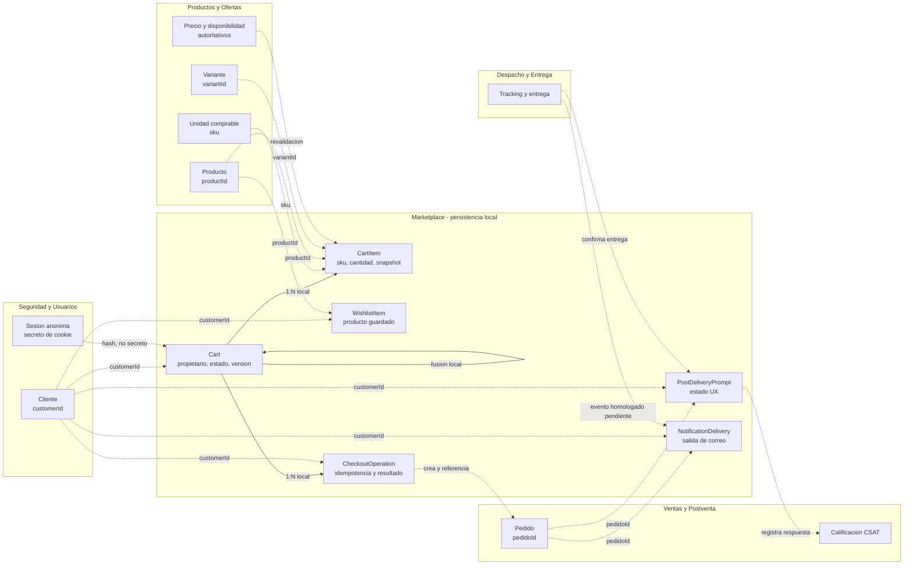

# Diagrama lógico

Esta vista muestra qué información conserva Marketplace y qué información consulta o referencia en módulos dueños.

## Leyenda

- Flecha continua: relación local implementada mediante FK o autorreferencia.
- Flecha discontinua: integración o referencia externa sin FK.
- Los snapshots de precio son informativos; la fuente autoritativa permanece en Productos y Ofertas.
- `PostDeliveryPrompt` no contiene la respuesta CSAT.
- `NotificationDelivery` no contiene el pedido ni el historial de despacho.
- La entrada de actualizaciones de despacho permanece condicionada por `I-05`.
