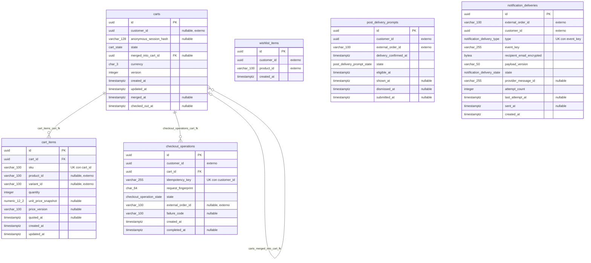

# Diagrama físico

Esta vista refleja las seis tablas del script PostgreSQL. Sólo dibuja relaciones respaldadas por FK locales.

Los tipos `varchar_100`, `numeric_12_2` y similares son adaptaciones visuales requeridas por la sintaxis Mermaid. En SQL corresponden a `varchar(100)`, `numeric(12,2)`, etc.

## Unicidades

| Tabla | Columnas | Implementación |
| --- | --- | --- |
| `carts` | `customer_id` | Índice único parcial para estado `ACTIVE`. |
| `carts` | `anonymous_session_hash` | Índice único parcial para estado `ACTIVE`. |
| `cart_items` | `cart_id, sku` | Constraint único. |
| `wishlist_items` | `customer_id, product_id` | Constraint único. |
| `checkout_operations` | `customer_id, idempotency_key` | Constraint único. |
| `post_delivery_prompts` | `customer_id, external_order_id` | Constraint único. |
| `notification_deliveries` | `type, event_key` | Constraint único. |

## Índices no únicos

```mermaid
flowchart TB
    IDX["Índices de acceso"]
    IDX --> C1["carts_merged_into_cart_idx"]
    IDX --> CI1["cart_items_product_id_idx"]
    IDX --> CI2["cart_items_variant_id_idx"]
    IDX --> W1["wishlist_items_customer_created_idx"]
    IDX --> CO1["checkout_operations_cart_created_idx"]
    IDX --> CO2["checkout_operations_state_created_idx"]
    IDX --> CO3["checkout_operations_external_order_idx"]
    IDX --> PP1["post_delivery_prompts_customer_state_idx"]
    IDX --> ND1["notification_deliveries_state_created_idx"]
    IDX --> ND2["notification_deliveries_order_idx"]
```

## Funciones y triggers

| Función | Trigger | Efecto |
| --- | --- | --- |
| `set_updated_at()` | `carts_set_updated_at` | Actualiza `carts.updated_at`. |
| `set_updated_at()` | `cart_items_set_updated_at` | Actualiza `cart_items.updated_at`. |
| `validate_cart_merge_target()` | `carts_validate_merge_target` | Exige destino autenticado y activo en una fusión. |
| `validate_active_cart_item_mutation()` | `cart_items_validate_active_cart` | Permite mutar líneas sólo en carritos activos e impide cambiar su `cart_id`. |

## Referencias sin FK

Las columnas `customer_id`, `product_id`, `variant_id`, `sku` y `external_order_id` se validan mediante sus APIs dueñas. Su presencia en el diagrama no implica acceso directo a otras bases de datos.
