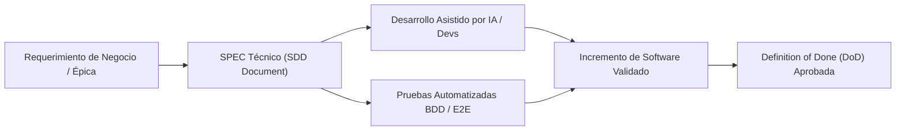
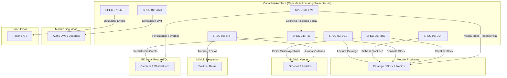

# Metodología Spec-Driven Development (SDD) & Catálogo Maestro de SPECS
## Canal Marketplace Multicanal

---

## 1. Visión General de la Metodología SDD

El desarrollo del **Canal Marketplace** se rige bajo la metodología **Spec-Driven Development (SDD)** con ingeniería asistida por Inteligencia Artificial. En este modelo, **cada Épica del sistema se formaliza como un SPEC (Software Design Document ejecutable y modular)**.

Un **SPEC** actúa como la **única fuente de verdad (*Single Source of Truth*)**, cerrando la brecha entre los requerimientos de producto (Historias de Usuario BDD en Gherkin, Reglas de Negocio) y el diseño de ingeniería de software (Frontend en Next.js, Backend en NestJS, Esquemas de Persistencia Relacional con Prisma y Contratos de Integración de Microservicios).

### Principios Fundamentales del SDD en la Fase de Planificación:
1. **Especificación antes de Codificación (*Spec-First*):** Ninguna línea de código de frontend o backend se implementa sin un SPEC previamente formalizado, revisado y versionado.
2. **Autocontenido y Riguroso:** Cada SPEC contiene todo el contexto técnico necesario: interfaces tipadas, DTOs con validadores, esquemas Prisma, contratos de API simulados (*Mocks*), diagramas de secuencia e interacciones entre servicios.
3. **Optimizado para Agentes de IA:** Los documentos proporcionan directivas técnicas inequívocas que eliminan alucinaciones y ambigüedades en la generación de código.
4. **Trazabilidad Bidireccional:** Cada escenario BDD (Gherkin) se vincula directamente a una prueba unitaria, de integración o componente de software.
5. **Límites de Dominio y Ownership:** Respeto estricto del aislamiento de persistencia y consumo de microservicios externos vía Capa D (Adaptadores) sin acceso cruzado a bases de datos.

---

## 2. Anatomía Canónica de un SPEC

Cada documento de especificación dentro del directorio `SPECS/` sigue una estructura estandarizada de 7 secciones obligatorias:

| Sección | Nombre | Propósito y Contenido Clave |
| :--- | :--- | :--- |
| **0** | **Metadatos y Control** | Código del SPEC, responsable técnico, rol asignado, puntos de historia (PH), prioridad y dependencias. |
| **1** | **Alcance y Contexto de Negocio** | Descripción de la funcionalidad, actores involucrados, reglas de negocio aplicables (`RN-GEN`) y criterios BDD en Gherkin. |
| **2** | **Diagrama de Secuencia (Mermaid)** | Flujo técnico de mensajes entre Usuario, Frontend (Next.js), Backend (NestJS), Persistencia (Prisma) y Microservicios Externos / Mocks. |
| **3** | **Diseño Técnico Frontend** | Pantallas impactadas, componentes UI (`shadcn/ui`, `Tailwind CSS 4`), estado global (`Zustand`), cliente HTTP (`TanStack Query`) y formularios (`React Hook Form` + `Zod`). |
| **4** | **Diseño Técnico Backend** | Endpoints REST (`@Controller`), DTOs estrictamente tipados (`class-validator`), servicios de dominio (`@Injectable()`) y coordinación de servicios. |
| **5** | **Persistencia y Capa de Adaptadores** | Modelos relacionales en Prisma ORM (`CartItem`, `WishlistItem` o confirmación de cero persistencia local) y contratos JSON de Mocks (`axios-mock-adapter`). |
| **6** | **Matriz de Excepciones y RNF** | Manejo de errores HTTP (400, 401, 404, 409, 422, 500), políticas de resiliencia, seguridad de credenciales y rendimiento. |
| **7** | **Plan de Verificación y DoD** | Pruebas unitarias, integración y E2E requeridas, junto al checklist de Definition of Done del responsable. |

---

## 3. Catálogo Maestro de SPECS del Marketplace

El sistema se compone de **8 SPECS**, totalizando **25 Historias de Usuario** y **91 Puntos de Historia (PH)**:

| Código SPEC | Épica Asociada | Nombre de la Especificación | HUs Cubiertas | PH | Responsable Técnico & Rol | Enlace al Documento |
| :--- | :--- | :--- | :---: | :---: | :--- | :--- |
| **`SPEC-01`** | **`EP-GAC`** | Gestión de Accesos del Cliente | 3 | 11 | **Andrés** — DevOps / Seguridad | [SPEC-01-EP-GAC](./SPEC-01-EP-GAC-Gestion-de-Accesos.md) |
| **`SPEC-02`** | **`EP-VEC`** | Vitrina y Exploración del Catálogo | 4 | 13 | **Leo** — Arquitecto de Aplicación | [SPEC-02-EP-VEC](./SPEC-02-EP-VEC-Vitrina-y-Exploracion-Catalogo.md) |
| **`SPEC-03`** | **`EP-DDP`** | Detalle y Disponibilidad de Producto | 4 | 11 | **Jim** — Product Owner | [SPEC-03-EP-DDP](./SPEC-03-EP-DDP-Detalle-y-Disponibilidad-Producto.md) |
| **`SPEC-04`** | **`EP-ITC`** | Intención de Transacción y Carrito de Compras | 2 | 8 | **Sebastián** — Documentador / Carrito | [SPEC-04-EP-ITC](./SPEC-04-EP-ITC-Carrito-y-Favoritos.md) |
| **`SPEC-05`** | **`EP-TRX`** | Transacción y Realización de Checkout | 3 | 13 | **Giuliano** — UX/UI | [SPEC-05-EP-TRX](./SPEC-05-EP-TRX-Checkout-y-Pago.md) |
| **`SPEC-06`** | **`EP-SHP`** | Seguimiento e Historial de Pedidos | 3 | 11 | **Diego** — JP / QA | [SPEC-06-EP-SHP](./SPEC-06-EP-SHP-Seguimiento-y-Pedidos.md) |
| **`SPEC-07`** | **`EP-SNT`** | Sistema de Notificaciones por Correo | 3 | 13 | **Saire** — QA / Cloud | [SPEC-07-EP-SNT](./SPEC-07-EP-SNT-Sistema-de-Notificaciones.md) |
| **`SPEC-08`** | **`EP-FAV`** | Gestión de Favoritos y Lista de Deseos | 3 | 11 | **Alonso** — Backend | [SPEC-08-EP-FAV](./SPEC-08-EP-FAV-Gestion-de-Favoritos.md) |
| **TOTAL** | **8 Épicas** | **Solución Integral Canal Marketplace** | **25** | **91** | **8 Integrantes** | — |

---

## 4. Matriz de Integración y Límites de Dominio en los SPECS

Cada SPEC respeta estrictamente los principios de **Ownership de Entidades y Desacoplamiento de Microservicios**:

> [!IMPORTANT]
> **Regla de Oro de Persistencia Relacional Local:**
> Únicamente los **`SPEC-04`** (`CartItem`) y **`SPEC-08`** (`WishlistItem`) interactúan con la base de datos relacional local (PostgreSQL 16 administrado vía Prisma ORM). Los demás SPECS operan de forma desacoplada delegando la persistencia a los microservicios dueños a través de la **Capa de Adaptadores (Capa D)** con `axios-mock-adapter` (Hitos 1 a 3) y microservicios reales (Hito 4).
