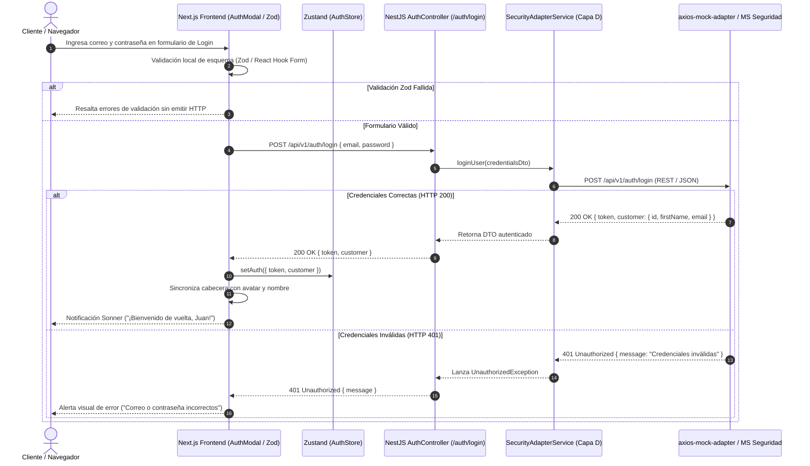

# SPEC-01: Gestión de Accesos del Cliente (EP-GAC)
## Software Design Document (SDD) — Canal Marketplace

---

## 0. Metadatos y Control del Documento

| Atributo | Detalle |
| :--- | :--- |
| **Código del SPEC** | `SPEC-01` |
| **Épica Asociada** | `EP-GAC` — Gestión de Accesos del Cliente |
| **Puntos de Historia (PH)** | **11 PH** (`HU-GAC-REG`: 5 PH, `HU-GAC-SES`: 3 PH, `HU-GAC-REC`: 3 PH) |
| **Prioridad Global** | **Alta (Bloqueante)** |
| **Responsable Técnico** | **Andrés** (DevOps / Seguridad) |
| **Estado** | **Listo para Implementación (Approved)** |
| **Versión** | `1.0.0` |

---

## 1. Alcance Funcional y Requisitos BDD

### 1.1. Contexto y Visión de la Épica
El módulo de Gestión de Accesos permite al usuario interactuar con el Marketplace de forma identificada y segura. Administra el registro de clientes, la autenticación delegada mediante JWT, la expiración/cierre de sesión y la recuperación de contraseñas, asegurando que el Marketplace nunca almacene contraseñas en su infraestructura local.

### 1.2. Reglas de Negocio Aplicables (`RN-GEN-01`)
1. **Unicidad de Cuenta:** El correo electrónico proporcionado debe ser estrictamente único en la plataforma.
2. **Validación Exhaustiva:** Todos los campos marcados como obligatorios deben validarse con tipado estricto antes de procesar el registro.
3. **Activación de Experiencia Personalizada:** El inicio de sesión válido habilita acceso inmediato a la lista de deseos, persistencia de carrito en servidor, historial de pedidos y flujo de checkout.
4. **Invalidación Inmediata:** El cierre de sesión purga de inmediato el token JWT y limpia los datos de sesión en memoria y cliente.
5. **Seguridad contra Enumeración de Usuarios:** La solicitud de recuperación de contraseña siempre responde con un mensaje genérico de confirmación, evitando revelar si un correo existe o no en el sistema.
6. **Tokens con Caducidad:** Los enlaces/tokens temporales de recuperación poseen un TTL máximo (15 minutos).

---

### 1.3. Historias de Usuario y Escenarios Gherkin

#### `HU-GAC-REG` — Registro de Cliente (5 PH)
- **Como** visitante del Marketplace,
- **Quiero** registrarme creando una cuenta con mis datos personales,
- **Para** formar parte de la plataforma y realizar compras futuras.

```gherkin
Escenario: Registro exitoso de un nuevo cliente
  Dado que un visitante no registrado está en el formulario de registro,
  Y completa todos los campos obligatorios con datos válidos,
  Cuando presiona el botón de confirmación de registro,
  Entonces el sistema crea la cuenta exitosamente,
  Y muestra un mensaje de confirmación invitando a iniciar sesión.

Escenario: Intento de registro con correo ya existente
  Dado que un usuario está en el formulario de registro,
  Y utiliza un correo electrónico que ya pertenece a una cuenta registrada,
  Cuando solicita la creación de la cuenta,
  Entonces el sistema deniega el registro,
  Y despliega una alerta indicando que el correo ya se encuentra en uso.

Escenario: Campos obligatorios incompletos
  Dado que un usuario está en el formulario de registro,
  Y omite rellenar uno o más campos obligatorios,
  Cuando intenta enviar el formulario,
  Entonces el sistema resalta los campos faltantes con un mensaje de error visual,
  Y no procesa la solicitud de registro.
```

#### `HU-GAC-SES` — Inicio y Cierre de Sesión del Cliente (3 PH)
- **Como** cliente registrado,
- **Quiero** iniciar y cerrar sesión con mis credenciales,
- **Para** acceder a mis funciones personalizadas y proteger mi cuenta al terminar.

```gherkin
Escenario: Inicio de sesión exitoso
  Dado que un cliente registrado ingresa su correo y contraseña correctos,
  Cuando presiona el botón de inicio de sesión,
  Entonces el sistema valida las credenciales,
  Y habilita la sesión del cliente mostrando su nombre en la barra de navegación.

Escenario: Intento de inicio de sesión con credenciales inválidas
  Dado que un cliente ingresa un correo o contraseña incorrectos,
  Cuando presiona el botón de inicio de sesión,
  Entonces el sistema deniega el acceso,
  Y muestra un mensaje de error indicando credenciales inválidas.

Escenario: Cierre de sesión voluntario
  Dado que un cliente tiene una sesión activa en el sistema,
  Cuando selecciona la opción de cerrar sesión,
  Entonces el sistema finaliza la sesión activa,
  Y redirige al usuario a la página principal en modo visitante.
```

#### `HU-GAC-REC` — Recuperación de Contraseña (3 PH)
- **Como** usuario registrado,
- **Quiero** solicitar la recuperación de mi contraseña olvidada,
- **Para** reestablecer mi acceso de forma segura.

```gherkin
Escenario: Solicitud de recuperación exitosa
  Dado que un usuario olvidó su contraseña y entra a la vista de recuperación,
  Cuando ingresa su correo electrónico registrado y envía la solicitud,
  Entonces el sistema procesa el requerimiento,
  Y muestra un mensaje confirmando el envío de instrucciones al correo.

Escenario: Solicitud con formato de correo inválido
  Dado que un usuario está en el formulario de recuperación de contraseña,
  Cuando ingresa un texto que no cumple con el formato de correo electrónico,
  Entonces el sistema bloquea el envío y muestra una advertencia de formato inválido.
```

---

## 2. Diagrama de Secuencia del Flujo Crítico (Mermaid)

### Flujo Crítico: Autenticación Delegada, Emisión de JWT y Activación de Sesión



---

## 3. Diseño Técnico Frontend (Next.js 14 / React)

### 3.1. Pantallas y Componentes
- **Componente Modal:** `components/auth/AuthDialog.tsx` (diálogo flotante modal con tabs: Iniciar Sesión / Crear Cuenta con `shadcn/ui` Dialog).
- **Vistas Dedicadas:** `app/(auth)/login/page.tsx`, `app/(auth)/register/page.tsx`, `app/(auth)/forgot-password/page.tsx`.
- **Componentes Atómicos:** `components/auth/LoginForm.tsx`, `components/auth/RegisterForm.tsx`, `components/auth/ForgotPasswordForm.tsx`.
- **Indicador de Usuario:** `components/layout/UserNav.tsx` (muestra botón "Ingresar" para visitantes o avatar + dropdown "Mi Cuenta" / "Cerrar Sesión" para autenticados).

### 3.2. Gestión de Estado y Formularios
- **Estado Global (`useAuthStore` con Zustand):**
  ```typescript
  interface AuthState {
    token: string | null;
    customer: { id: string; firstName: string; lastName: string; email: string } | null;
    isAuthenticated: boolean;
    setAuth: (token: string, customer: Customer) => void;
    logout: () => void;
  }
  ```
- **Validación con Zod (`lib/validations/auth.ts`):**
  - `loginSchema`: correo electrónico válido, contraseña mínimo 6 caracteres.
  - `registerSchema`: nombres, apellidos, teléfono (9 dígitos), correo y contraseña con mínimo 8 caracteres alfanuméricos.
  - `forgotPasswordSchema`: correo electrónico en formato RFC 5322.

---

## 4. Diseño Técnico Backend (NestJS)

### 4.1. Controlador REST (`AuthController`)
- **Ruta Base:** `@Controller('auth')`
- **Endpoints:**
  - `POST /api/v1/auth/register` — Recibe `RegisterRequestDto`, retorna `201 Created`.
  - `POST /api/v1/auth/login` — Recibe `LoginRequestDto`, retorna `200 OK` con JWT.
  - `POST /api/v1/auth/forgot-password` — Recibe `ForgotPasswordDto`, retorna `200 OK`.
  - `GET /api/v1/auth/me` — Protegido con `AuthGuard` (JWT Bearer), retorna el perfil del cliente.

### 4.2. DTOs Tipados con `class-validator`
```typescript
export class RegisterRequestDto {
  @IsString() @IsNotEmpty() firstName: string;
  @IsString() @IsNotEmpty() lastName: string;
  @IsEmail() email: string;
  @IsString() @MinLength(8) password: string;
  @IsString() @Matches(/^[0-9]{9}$/) phone: string;
}

export class LoginRequestDto {
  @IsEmail() email: string;
  @IsString() @IsNotEmpty() password: string;
}
```

### 4.3. Guardia de Autenticación (`AuthGuard`)
- Extrae el token `Authorization: Bearer <jwt>`.
- Decodifica el payload (sub, email, name, exp).
- Si el token expiró o es inválido, rechaza con `401 Unauthorized`.
- Inyecta `req.user = { customerId, email }` en el contexto de ejecución.

---

## 5. Persistencia y Contratos de Integración (Capa D)

### 5.1. Persistencia Local
> [!IMPORTANT]
> **Cero Persistencia Local:** Este módulo **NO** crea tablas en la base de datos PostgreSQL local para credenciales, hashes de contraseña ni perfiles. La identidad reside 100% en el **Módulo de Seguridad y Usuarios**.

### 5.2. Capa de Adaptadores (`SecurityAdapterService`)
- Encapsula las llamadas HTTP salientes mediante `HttpService` (`@nestjs/axios`).
- En entornos con `USE_MOCKS=true`, las peticiones son interceptadas por `axios-mock-adapter`.

### 5.3. Contratos de Mocks API (`axios-mock-adapter`)

#### A. Registro de Cliente (`HU-GAC-REG`)
- **Endpoint:** `POST /api/v1/auth/register`
- **Payload Request:**
  ```json
  {
    "firstName": "Juan",
    "lastName": "Pérez",
    "email": "juan.perez@deportes.com",
    "password": "SecretPassword123",
    "phone": "987654321"
  }
  ```
- **Response 201 Created (Éxito):**
  ```json
  {
    "statusCode": 201,
    "message": "Usuario registrado exitosamente",
    "customerId": "CUST-8842"
  }
  ```
- **Response 409 Conflict (Correo duplicado):**
  ```json
  {
    "statusCode": 409,
    "error": "Conflict",
    "message": "El correo electrónico ya se encuentra registrado en la plataforma"
  }
  ```

#### B. Inicio de Sesión (`HU-GAC-SES`)
- **Endpoint:** `POST /api/v1/auth/login`
- **Payload Request:**
  ```json
  {
    "email": "juan.perez@deportes.com",
    "password": "SecretPassword123"
  }
  ```
- **Response 200 OK (Éxito):**
  ```json
  {
    "token": "eyJhbGciOiJIUzI1NiIsInR5cCI6IkpXVCJ9.eyJzdWIiOiJDVVNULTg4NDIiLCJuYW1lIjoiSnVhbiBQw6lyZXoiLCJlbWFpbCI6Imp1YW4ucGVyZXpAZGVwb3J0ZXMuY29tIiwiaWF0IjoxNzI2MTEzNjAwLCJleHAiOjE3MjYxOTcwMDB9.signature",
    "customer": {
      "id": "CUST-8842",
      "firstName": "Juan",
      "lastName": "Pérez",
      "email": "juan.perez@deportes.com"
    }
  }
  ```
- **Response 401 Unauthorized (Error de credenciales):**
  ```json
  {
    "statusCode": 401,
    "error": "Unauthorized",
    "message": "Credenciales inválidas"
  }
  ```

---

## 6. Matriz de Excepciones y Requisitos No Funcionales (RNF)

| Escenario de Falla / Borde | Código HTTP | Acción del Sistema / Resiliencia |
| :--- | :---: | :--- |
| **Correo Duplicado en Registro** | `409 Conflict` | La UI muestra toast de advertencia invitando a iniciar sesión o recuperar clave. |
| **Credenciales Inválidas** | `401 Unauthorized` | Se incrementa contador visual de intentos; no se limpian los campos excepto contraseña. |
| **Expiración de Token JWT** | `401 Unauthorized` | Interceptor de Axios en Frontend detecta expiración, invoca `logout()` y redirige a login. |
| **Timeout de Servicio de Seguridad** | `504 Gateway Timeout` | Política de reintento con backoff exponencial (máx. 2 reintentos); si falla, toast amigable. |
| **Seguridad de Datos Sensibles** | `RNF-SEG-01` | Contraseñas nunca se imprimen en logs de NestJS (`AuditLogger` sanitiza campo `password`). |

---

## 7. Plan de Verificación y Definition of Done (DoD)

### 7.1. Pruebas Requeridas
- **Unitarias (Jest):**
  - Validación de esquemas Zod (`registerSchema`, `loginSchema`) con casos válidos e inválidos.
  - Validación de `AuthGuard` de NestJS con tokens válidos, expirados y malformados.
- **Integración (Supertest + NestJS Test):**
  - Ejecución de `POST /auth/register` verificando retorno 201 y 409 con `axios-mock-adapter`.
  - Ejecución de `POST /auth/login` comprobando emisión de token JWT y payload de cliente.
- **E2E (Playwright / Cypress):**
  - Flujo completo: Registro -> Inicio de sesión -> Visualización de nombre en navbar -> Cierre de sesión.

### 7.2. Checklist de Definition of Done (Responsable: Andrés)
- [ ] 100% de los 3 escenarios BDD en Gherkin pasando en verde.
- [ ] Cero persistencia local de usuarios en base de datos PostgreSQL.
- [ ] Token JWT almacenado en memoria / cookies seguras HTTP-only.
- [ ] Componente `AuthDialog` completamente responsivo en mobile y desktop.
- [ ] Pipeline CI/CD en GitHub Actions ejecutando pruebas unitarias de autenticación.
