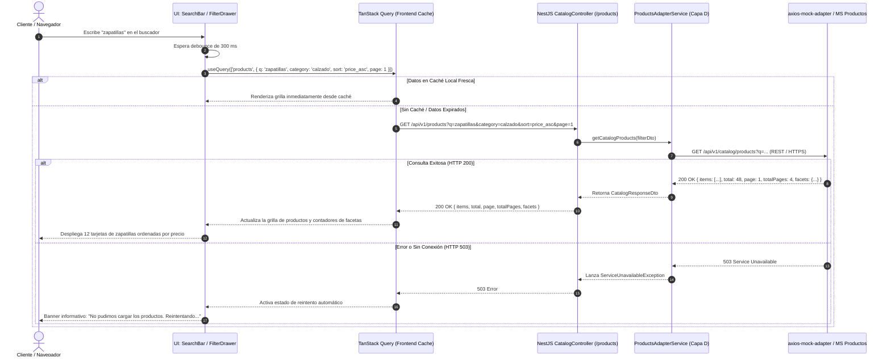

# SPEC-02: Vitrina y Exploración del Catálogo (EP-VEC)
## Software Design Document (SDD) — Canal Marketplace

---

## 0. Metadatos y Control del Documento

| Atributo | Detalle |
| :--- | :--- |
| **Código del SPEC** | `SPEC-02` |
| **Épica Asociada** | `EP-VEC` — Vitrina y Exploración del Catálogo |
| **Puntos de Historia (PH)** | **13 PH** (`HU-VEC-BUS`: 3 PH, `HU-VEC-FIL`: 5 PH, `HU-VEC-HOM`: 3 PH, `HU-VEC-ORD`: 2 PH) |
| **Prioridad Global** | **Alta** |
| **Responsable Técnico** | **Leo** (Arquitecto de Aplicación) |
| **Estado** | **Listo para Implementación (Approved)** |
| **Versión** | `1.0.0` |

---

## 1. Alcance Funcional y Requisitos BDD

### 1.1. Contexto y Visión de la Épica
La Vitrina y Exploración del Catálogo constituye la puerta de entrada visual al comercio electrónico. Permite al cliente (tanto visitante como autenticado) descubrir artículos deportivos mediante la página principal, realizar búsquedas reactivas con texto predictivo, filtrar por múltiples facetas (categoría, marca, rango de precio) y ordenar los resultados según sus preferencias comerciales.

### 1.2. Reglas de Negocio Aplicables (`RN-GEN-02`)
1. **Búsqueda Flexible:** La búsqueda por palabra clave opera sobre coincidencias parciales o totales en nombre del producto, descripción y categoría.
2. **Umbral Mínimo y Debounce:** No se disparan búsquedas automáticas con términos menores a 2 caracteres. La búsqueda automática en frontend aplica un *debounce* de 300 ms.
3. **Filtrado Facetado e Inclusivo:** Se admite selección múltiple de marcas y categorías concurrentemente.
4. **Paginación Dosificada:** Los resultados se presentan en bloques dosificados (12 artículos por página) para garantizar alta velocidad de renderizado (RNF-PER-01).
5. **Restablecimiento Global:** Existe la acción de "Limpiar Filtros" que devuelve el catálogo a su estado base en un solo clic.
6. **Criterios de Ordenamiento Oficiales:** Soportados: `"price_asc"` (Menor a Mayor), `"price_desc"` (Mayor a Menor), `"newest"` (Más Recientes) y `"relevance"` (Relevancia).

---

### 1.3. Historias de Usuario y Escenarios Gherkin

#### `HU-VEC-BUS` — Búsqueda de Productos por Palabra Clave (3 PH)
- **Como** cliente del Marketplace,
- **Quiero** buscar productos ingresando palabras clave en la barra de búsqueda,
- **Para** localizar rápidamente artículos de mi interés.

```gherkin
Escenario: Búsqueda con resultados coincidentes
  Dado que el cliente ingresa una palabra clave con al menos 2 caracteres en el buscador,
  Cuando presiona la tecla enter o espera el debounce del buscador,
  Entonces el sistema despliega una grilla con los productos que coinciden con el término,
  Y muestra el total de coincidencias encontradas.

Escenario: Búsqueda sin coincidencias en catálogo
  Dado que el cliente ingresa un término que no existe en el catálogo de productos,
  Cuando ejecuta la búsqueda,
  Entonces el sistema muestra un estado visual vacío ("Sin resultados"),
  Y sugiere términos populares o volver a ver todo el catálogo.
```

#### `HU-VEC-FIL` — Navegación y Filtrado Dinámico por Categorías y Marcas (5 PH)
- **Como** cliente del Marketplace,
- **Quiero** filtrar los artículos por categorías y marcas en un panel lateral,
- **Para** acotar los resultados según mis preferencias específicas de compra.

```gherkin
Escenario: Aplicación de filtros múltiples
  Dado que el cliente se encuentra visualizando el catálogo de productos,
  Cuando marca una o más categorías y marcas en el panel lateral de filtros,
  Entonces el catálogo se actualiza dinámicamente sin recargar la página,
  Y muestra exclusivamente los artículos que satisfacen todos los filtros seleccionados.

Escenario: Restablecimiento de filtros aplicados
  Dado que el cliente tiene filtros de categoría y marca activos,
  Cuando presiona el botón "Limpiar Filtros",
  Entonces el sistema desmarca todas las casillas del panel,
  Y recarga el catálogo completo en su estado predeterminado.
```

#### `HU-VEC-HOM` — Visualización de la Página Principal y Destacados (3 PH)
- **Como** visitante o cliente,
- **Quiero** ver una página de inicio con banners, accesos a categorías y artículos destacados,
- **Para** conocer las novedades y promociones de la tienda.

```gherkin
Escenario: Carga exitosa de la página principal
  Dado que un usuario navega a la URL raíz del Marketplace,
  Cuando la página termina de cargar,
  Entonces el sistema renderiza el banner principal, la cuadrícula de categorías destacadas,
  Y una sección con los artículos en tendencia u oferta.
```

#### `HU-VEC-ORD` — Ordenamiento del Catálogo de Productos (2 PH)
- **Como** comprador,
- **Quiero** ordenar el listado de productos por precio y fecha de novedad,
- **Para** priorizar las ofertas más económicas o los últimos lanzamientos.

```gherkin
Escenario: Ordenamiento por precio de menor a mayor
  Dado que el cliente está en el listado del catálogo con múltiples productos,
  Cuando selecciona la opción "Precio: Menor a Mayor" en el selector de orden,
  Entonces los artículos se reordenan ascendentemente según su precio final con descuento.
```

---

## 2. Diagrama de Secuencia del Flujo Crítico (Mermaid)

### Flujo Crítico: Búsqueda Reactiva con Debounce, Filtros y Paginación



---

## 3. Diseño Técnico Frontend (Next.js 14 / React)

### 3.1. Rutas y Páginas
- `app/page.tsx`: Página Home con Hero Banner, accesos directos a categorías y carrusel de destacados (`FeaturedProductsCarousel`).
- `app/catalog/page.tsx`: Página principal de exploración del catálogo con parámetros sincronizados en la URL (`/catalog?q=...&category=...&brand=...&sort=...&page=1`).

### 3.2. Componentes de UI (`shadcn/ui` + Tailwind CSS 4)
- `components/catalog/SearchBar.tsx`: Input con ícono de lupa (Lucide `Search`), botón de limpieza inmediata y hook `useDebounce`.
- `components/catalog/FilterSidebar.tsx`: Acordeón colapsable con checkboxes (`shadcn/ui` Checkbox) para Categorías, Marcas y sliders para Rango de Precios.
- `components/catalog/SortDropdown.tsx`: Selector desplegable (`shadcn/ui` Select) con las 4 opciones de ordenamiento.
- `components/catalog/ProductGrid.tsx`: Cuadrícula responsiva (`grid-cols-1 sm:grid-cols-2 md:grid-cols-3 lg:grid-cols-4 gap-6`).
- `components/catalog/ProductCard.tsx`: Tarjeta de producto con badge de descuento, precio original tachado, imagen optimizada (`next/image`) y botón de añadir rápido / ver detalle.
- `components/catalog/PaginationControls.tsx`: Paginador con flechas anterior/siguiente y números de página.

---

## 4. Diseño Técnico Backend (NestJS)

### 4.1. Controlador REST (`CatalogController`)
- **Ruta Base:** `@Controller('products')`
- **Endpoints:**
  - `GET /api/v1/products` — Consulta filtrada y paginada del catálogo.
  - `GET /api/v1/products/featured` — Retorna artículos destacados para la Home.
  - `GET /api/v1/products/categories` — Retorna listado maestro de categorías y marcas con conteo de ítems.

### 4.2. DTO de Filtros con `class-validator`
```typescript
export class GetProductsQueryDto {
  @IsOptional() @IsString() q?: string;
  @IsOptional() @IsString() category?: string;
  @IsOptional() @IsString() brand?: string;
  @IsOptional() @IsIn(['price_asc', 'price_desc', 'newest', 'relevance']) sort?: string = 'newest';
  @IsOptional() @Type(() => Number) @IsInt() @Min(1) page?: number = 1;
  @IsOptional() @Type(() => Number) @IsInt() @Min(1) @Max(50) limit?: number = 12;
}
```

---

## 5. Persistencia y Contratos de Integración (Capa D)

### 5.1. Persistencia Local
> [!IMPORTANT]
> **Cero Persistencia Local:** Toda la información del catálogo (artículos, fotos, precios, categorías y stock) es propiedad exclusiva del **Módulo de Productos y Ofertas**. El Marketplace no almacena tablas de catálogo en PostgreSQL local.

### 5.2. Capa de Adaptadores (`ProductsAdapterService`)
- Encapsula las solicitudes HTTP dirigidas al microservicio externo o mock mediante `HttpService`.
- Sincroniza facetas dinámicas (conteo de productos disponibles por categoría y marca).

### 5.3. Contratos de Mocks API (`axios-mock-adapter`)

#### Consulta de Catálogo con Filtros y Paginación (`HU-VEC-BUS`, `FIL`, `ORD`)
- **Endpoint:** `GET /api/v1/catalog/products`
- **Query Params:** `?q=zapatilla&category=calzado&brand=nike&sort=price_asc&page=1&limit=12`
- **Response 200 OK:**
  ```json
  {
    "total": 24,
    "page": 1,
    "limit": 12,
    "totalPages": 2,
    "items": [
      {
        "id": "PROD-101",
        "name": "Zapatilla Running Nike Air Zoom Pegasus",
        "brand": "Nike",
        "category": "Calzado",
        "price": 389.90,
        "originalPrice": 459.90,
        "discountPercentage": 15,
        "rating": 4.8,
        "thumbnail": "https://images.unsplash.com/photo-1542291026-7eec264c27ff",
        "hasStock": true,
        "variantsCount": 5
      },
      {
        "id": "PROD-102",
        "name": "Zapatilla Nike Revolution 6",
        "brand": "Nike",
        "category": "Calzado",
        "price": 219.00,
        "originalPrice": null,
        "discountPercentage": 0,
        "rating": 4.5,
        "thumbnail": "https://images.unsplash.com/photo-1595950653106-6c9ebd614d3a",
        "hasStock": true,
        "variantsCount": 3
      }
    ],
    "facets": {
      "categories": [
        { "name": "Calzado", "count": 24 },
        { "name": "Ropa Deportiva", "count": 12 }
      ],
      "brands": [
        { "name": "Nike", "count": 18 },
        { "name": "Adidas", "count": 6 }
      ]
    }
  }
  ```

---

## 6. Matriz de Excepciones y Requisitos No Funcionales (RNF)

| Escenario de Falla / Borde | Código HTTP | Acción del Sistema / Resiliencia |
| :--- | :---: | :--- |
| **Búsqueda sin Coincidencias** | `200 OK` (items: `[]`) | Muestra ilustración "Sin resultados", con botón para limpiar filtros y recomendaciones. |
| **Término con < 2 Caracteres** | N/A (Frontend) | El cliente HTTP en Next.js no emite petición; mantiene el estado actual. |
| **Latencia de Red Excesiva** | `RNF-PER-01` | La grilla despliega *Skeletons* animados (`shadcn/ui` Skeleton) durante la carga asíncrona. |
| **Fallo en Microservicio de Productos**| `503 Service Unavailable` | Se activa fallback en caché de TanStack Query (Stale-While-Revalidate); alerta amigable. |

---

## 7. Plan de Verificación y Definition of Done (DoD)

### 7.1. Pruebas Requeridas
- **Unitarias (Jest):**
  - Validación de parsing de query params en `GetProductsQueryDto`.
  - Verificación de lógica de debounce y filtrado de facetas en React.
- **Integración:**
  - Peticiones con combinaciones de filtros (`category`, `brand`, `sort`, `page`) contra `axios-mock-adapter`.
- **E2E:**
  - Navegación desde Home -> Búsqueda por texto -> Aplicación de filtro de marca -> Cambio de ordenamiento por precio.

### 7.2. Checklist de Definition of Done (Responsable: Leo)
- [ ] 100% de los 4 escenarios BDD de vitrina validados en Gherkin.
- [ ] Renderizado sin recargas de página completas (*SPA Experience*).
- [ ] Sincronización bidireccional entre filtros de UI y Query String en la barra de URL del navegador.
- [ ] Paginación y layout responsivo probado en resoluciones mobile (375px), tablet (768px) y desktop (1440px).
