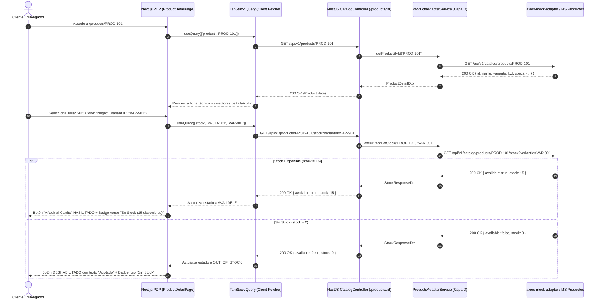

# SPEC-03: Detalle y Disponibilidad de Producto (EP-DDP)
## Software Design Document (SDD) — Canal Marketplace

---

## 0. Metadatos y Control del Documento

| Atributo | Detalle |
| :--- | :--- |
| **Código del SPEC** | `SPEC-03` |
| **Épica Asociada** | `EP-DDP` — Detalle y Disponibilidad de Producto |
| **Puntos de Historia (PH)** | **11 PH** (`HU-DDP-FIC`: 3 PH, `HU-DDP-ATR`: 3 PH, `HU-DDP-STK`: 3 PH, `HU-DDP-REL`: 2 PH) |
| **Prioridad Global** | **Alta** |
| **Responsable Técnico** | **Jim** (Product Owner) |
| **Estado** | **Listo para Implementación (Approved)** |
| **Versión** | `1.0.0` |

---

## 1. Alcance Funcional y Requisitos BDD

### 1.1. Contexto y Visión de la Épica
Esta especificación define la experiencia inmersiva del detalle de producto (PDP - *Product Detail Page*). Proporciona la ficha técnica completa, galería de fotos en alta resolución con zoom, selector interactivo de variantes (color, talla), consulta asíncrona de inventario en tiempo real (evitando compras de artículos agotados) y recomendaciones cruzadas de artículos deportivos relacionados.

### 1.2. Reglas de Negocio Aplicables (`RN-GEN-03`)
1. **Fidelidad y Autoridad de Catálogo:** Toda la información técnica y de precios proviene exclusivamente del Módulo de Productos y Ofertas (owner legítimo).
2. **Despliegue de Ofertas:** Si el producto o variante cuenta con descuento activo, debe exhibirse el precio original tachado, el precio final en oferta y el badge con el porcentaje de ahorro.
3. **Selección Obligatoria de Variantes:** La acción "Añadir al Carrito" permanece bloqueada hasta que el usuario seleccione todas las variantes obligatorias (ej. Talla y Color).
4. **Actualización Contextual:** Al seleccionar una variante, la galería fotográfica y el precio deben actualizarse inmediatamente si dicha combinación tiene imagen o tarifa específica.
5. **Comprobación Estricta de Stock:** Solo se permite la compra si el inventario devuelto por la API externa es estrictamente mayor a cero (`stock > 0`). Si el stock es 0, el botón se inhabilita mostrando "Agotado".
6. **Recomendaciones Contextuales:** Los productos relacionados sugeridos deben pertenecer a la misma categoría deportiva o marca comercial.

---

### 1.3. Historias de Usuario y Escenarios Gherkin

#### `HU-DDP-FIC` — Ficha Técnica, Galería y Ofertas (3 PH)
- **Como** comprador,
- **Quiero** ver la ficha técnica, fotografías y ofertas de un artículo,
- **Para** evaluar sus especificaciones antes de decidir mi compra.

```gherkin
Escenario: Visualización exitosa de la ficha técnica de un producto
  Dado que el cliente hace clic en una tarjeta de producto del catálogo,
  Cuando carga la página de detalle,
  Entonces el sistema muestra el título, marca, galería de fotos, descripción detallada,
  Y las especificaciones técnicas estructuradas.

Escenario: Producto con descuento promocional activo
  Dado que el producto seleccionado cuenta con un descuento vigente,
  Cuando el cliente visualiza el bloque de precios,
  Entonces el sistema exhibe el precio original tachado, el precio final rebajado,
  Y una etiqueta con el porcentaje de descuento aplicado.
```

#### `HU-DDP-ATR` — Selección de Atributos y Variantes (3 PH)
- **Como** comprador,
- **Quiero** seleccionar atributos como talla, color o modelo,
- **Para** configurar la versión exacta del producto que deseo comprar.

```gherkin
Escenario: Selección de talla y color disponible
  Dado que el cliente está en la página de un producto con múltiples variantes,
  Cuando selecciona una talla y un color específicos,
  Entonces el sistema actualiza la fotografía principal con la variante elegida,
  Y recalcula la disponibilidad de stock para esa combinación.

Escenario: Intento de compra sin seleccionar atributos requeridos
  Dado que el producto requiere selección obligatoria de talla,
  Cuando el cliente presiona el botón de agregar al carrito sin elegir una opción,
  Entonces el sistema resalta el selector de tallas en color de alerta,
  Y no agrega el producto al carrito hasta completar la selección.
```

#### `HU-DDP-STK` — Consulta y Validación de Inventario (3 PH)
- **Como** comprador,
- **Quiero** saber si el producto o variante elegida tiene stock disponible,
- **Para** no intentar comprar artículos fuera de inventario.

```gherkin
Escenario: Producto con stock disponible en almacén
  Dado que el cliente selecciona una variante con stock disponible (stock > 0),
  Cuando el sistema consulta el inventario en tiempo real,
  Entonces habilita el botón de agregar al carrito,
  Y muestra un indicador de disponibilidad ("En stock").

Escenario: Variante sin inventario (Agotada)
  Dado que la combinación de talla y color seleccionada tiene stock igual a 0,
  Cuando el sistema valida la disponibilidad,
  Entonces el botón de compra cambia a estado deshabilitado ("Agotado"),
  Y muestra una alerta impidiendo agregar el artículo.
```

#### `HU-DDP-REL` — Productos Relacionados y Sugeridos (2 PH)
- **Como** cliente explorador,
- **Quiero** ver productos similares o recomendados al final de la página,
- **Para** descubrir alternativas complementarias a mi búsqueda.

```gherkin
Escenario: Despliegue de carrusel de artículos relacionados
  Dado que el cliente se encuentra en la sección inferior de la ficha técnica,
  Cuando el componente de recomendaciones finaliza su carga asíncrona,
  Entonces muestra un carrusel con hasta 6 productos de la misma categoría o marca.
```

---

## 2. Diagrama de Secuencia del Flujo Crítico (Mermaid)

### Flujo Crítico: Selección de Variante, Comprobación Asíncrona de Stock y Habilitación de Compra



---

## 3. Diseño Técnico Frontend (Next.js 14 / React)

### 3.1. Rutas y Páginas
- `app/products/[id]/page.tsx`: Página dinámica con generación híbrida (SSR con datos iniciales + hidratación de stock en tiempo real).

### 3.2. Componentes de UI (`shadcn/ui` + Tailwind CSS 4)
- `components/product/ProductGallery.tsx`: Carrusel de miniaturas con visor principal y funcionalidad de zoom interactivo en hover.
- `components/product/VariantSelector.tsx`: Selector de fichas de color (swatches visuales) y botones de tallas (`shadcn/ui` ToggleGroup).
- `components/product/StockBadge.tsx`: Badge visual dinámico (`Badge` variant: default verde / destructive rojo) reflejando disponibilidad.
- `components/product/QuantitySelector.tsx`: Selector numérico con botones `+` y `-` limitado al stock máximo devuelto.
- `components/product/ProductSpecsAccordion.tsx`: Pestañas colapsables (`shadcn/ui` Accordion) para descripción, materiales, cuidados y garantía.
- `components/product/RelatedProductsCarousel.tsx`: Carrusel horizontal de tarjetas sugeridas.

---

## 4. Diseño Técnico Backend (NestJS)

### 4.1. Controlador REST (`CatalogController`)
- **Endpoints de Detalle:**
  - `GET /api/v1/products/:id` — Ficha técnica completa del producto con sus variantes.
  - `GET /api/v1/products/:id/stock?variantId=...` — Validación rápida de disponibilidad.
  - `GET /api/v1/products/:id/related` — Consulta de productos complementarios.

### 4.2. DTOs de Validación
```typescript
export class CheckStockQueryDto {
  @IsNotEmpty()
  @IsString()
  variantId: string;
}

export class StockResponseDto {
  available: boolean;
  stock: number;
  maxPurchaseLimit?: number;
}
```

---

## 5. Persistencia y Contratos de Integración (Capa D)

### 5.1. Persistencia Local
> [!IMPORTANT]
> **Cero Persistencia Local:** Este módulo no guarda productos ni fichas técnicas en PostgreSQL local. Todas las llamadas se canalizan al **Módulo de Productos y Ofertas**.

### 5.2. Contratos de Mocks API (`axios-mock-adapter`)

#### A. Detalle del Producto (`HU-DDP-FIC`, `ATR`)
- **Endpoint:** `GET /api/v1/catalog/products/PROD-101`
- **Response 200 OK:**
  ```json
  {
    "id": "PROD-101",
    "name": "Zapatilla Running Nike Air Zoom Pegasus 40",
    "brand": "Nike",
    "sku": "NK-PEG40-BLK",
    "description": "Amortiguación elástica para cualquier carrera. Diseñadas para devorar kilómetros.",
    "price": 389.90,
    "originalPrice": 459.90,
    "discountPercentage": 15,
    "images": [
      "https://images.unsplash.com/photo-1542291026-7eec264c27ff",
      "https://images.unsplash.com/photo-1608231387042-66d1773070a5"
    ],
    "variants": [
      { "id": "VAR-901", "size": "42", "color": "Negro", "stock": 15, "sku": "NK-PEG40-42-BLK" },
      { "id": "VAR-902", "size": "43", "color": "Negro", "stock": 0, "sku": "NK-PEG40-43-BLK" },
      { "id": "VAR-903", "size": "41", "color": "Azul", "stock": 4, "sku": "NK-PEG40-41-BLU" }
    ],
    "specs": {
      "Material Exterior": "Malla técnica transpirable",
      "Suela": "Goma con patrón tipo gofre",
      "Tipo de Pisada": "Neutra",
      "Peso": "285 gramos"
    }
  }
  ```

#### B. Validación de Stock en Tiempo Real (`HU-DDP-STK`)
- **Endpoint:** `GET /api/v1/catalog/products/PROD-101/stock?variantId=VAR-901`
- **Response 200 OK:**
  ```json
  {
    "productId": "PROD-101",
    "variantId": "VAR-901",
    "available": true,
    "stock": 15
  }
  ```

---

## 6. Matriz de Excepciones y Requisitos No Funcionales (RNF)

| Escenario de Falla / Borde | Código HTTP | Acción del Sistema / Resiliencia |
| :--- | :---: | :--- |
| **ID de Producto No Existente** | `404 Not Found` | Redirección a página personalizada `not-found.tsx` con sugerencia de búsqueda. |
| **Variante con Stock Cero** | `200 OK` (`stock: 0`) | Se bloquea botón "Añadir al Carrito", mostrando mensaje: "Esta talla está temporalmente agotada". |
| **Petición sin Parámetro variantId** | `400 Bad Request` | Backend retorna error 400; frontend desactiva botón hasta seleccionar atributos. |
| **Latencia de Imágenes** | `RNF-PER-02` | Las fotos usan `next/image` con formato WebP/AVIF y tamaños responsivos optimizados. |

---

## 7. Plan de Verificación y Definition of Done (DoD)

### 7.1. Pruebas Requeridas
- **Unitarias:** Verificación de selector de variantes y cálculo de precio en oferta.
- **Integración:** Consulta de `GET /products/:id` y `GET /products/:id/stock` simulando stock positivo y stock cero.
- **E2E:** Flujo completo de navegación: Ingreso a PDP -> Cambio de variante -> Validación de stock -> Habilitación de botón de compra.

### 7.2. Checklist de Definition of Done (Responsable: Jim)
- [ ] 100% de los 4 escenarios BDD de detalle y stock aprobados en Gherkin.
- [ ] Selector de tallas y colores visualmente accesible con estados de foco (`aria-selected`).
- [ ] Bloqueo preventivo de compra cuando `stock === 0`.
- [ ] Visualización clara y transparente de descuentos y precios tachados.
