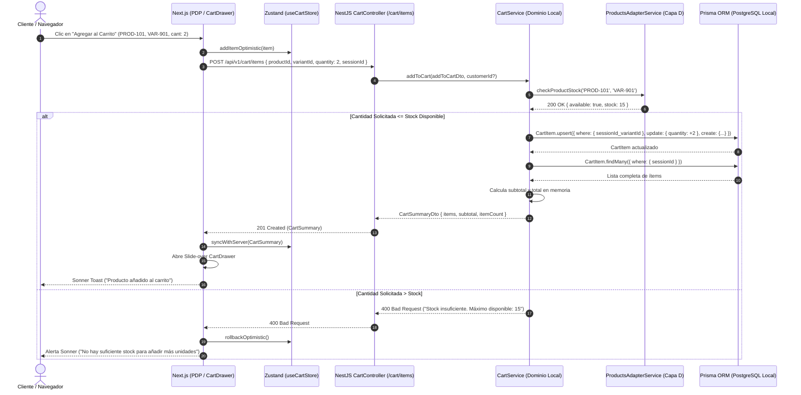

# SPEC-04: Intención de Transacción y Carrito de Compras (EP-ITC)
## Software Design Document (SDD) — Canal Marketplace

---

## 0. Metadatos y Control del Documento

| Atributo | Detalle |
| :--- | :--- |
| **Código del SPEC** | `SPEC-04` |
| **Épica Asociada** | `EP-ITC` — Intención de Transacción y Carrito de Compras |
| **Puntos de Historia (PH)** | **8 PH** (`HU-ITC-CAR`: 5 PH, `HU-ITC-RES`: 3 PH) *(Gestión de Favoritos delegada a `SPEC-08` / `EP-FAV`: 11 PH)* |
| **Prioridad Global** | **Alta (Crítico para Conversión)** |
| **Responsable Técnico** | **Sebastián** (Documentador / Desarrollo de Carrito) |
| **Estado** | **Listo para Implementación (Approved)** |
| **Versión** | `1.1.0` |

---

## 1. Alcance Funcional y Requisitos BDD

### 1.1. Contexto y Visión de la Épica
El módulo de Carrito de Compras y Lista de Deseos administra la intención de compra del cliente. Soporta tanto usuarios anónimos (mediante ID de sesión temporal) como clientes autenticados. Proporciona un carrito flotante lateral (*Slide-over Sheet*), cálculo reactivo de subtotales sin recarga de página, unificación automática de carritos anónimos al iniciar sesión (*Cart Merging*) y persistencia relacional en la base de datos PostgreSQL local para favoritos y carritos activos.

### 1.2. Reglas de Negocio Aplicables (`RN-GEN-04`)
1. **Agrupación de Líneas:** Si un producto y variante ya existen en el carrito y se añade nuevamente, el sistema incrementa la cantidad en lugar de duplicar la fila.
2. **Tope de Inventario:** La cantidad seleccionada jamás puede exceder el límite de inventario devuelto por la API del Módulo de Productos.
3. **Unificación de Carritos (*Cart Merging*):** Cuando un visitante anónimo inicia sesión, los productos acumulados en su carrito local se transfieren y fusionan automáticamente con los de su cuenta registrada.
4. **Cálculo en Tiempo Real:** El subtotal por artículo y el total acumulado deben recalcularse dinámicamente ante cualquier incremento, decremento o eliminación.
5. **Persistencia de Favoritos:** La lista de deseos (`WishlistItem`) requiere cliente autenticado y persiste de forma permanente en PostgreSQL local asociada a su `customerId`.
6. **Revalidación al Mover a Carrito:** Al transferir un artículo de Favoritos al Carrito, se valida en tiempo real la disponibilidad de stock.

---

### 1.3. Historias de Usuario y Escenarios Gherkin

#### `HU-ITC-CAR` — Gestión de Productos en el Carrito (5 PH)
- **Como** comprador,
- **Quiero** agregar, modificar cantidades y eliminar artículos de mi carrito,
- **Para** preparar la selección de productos que voy a adquirir.

```gherkin
Escenario: Adición de un producto nuevo al carrito
  Dado que el cliente está en la página de un producto con stock disponible,
  Cuando hace clic en "Agregar al Carrito",
  Entonces el sistema añade el artículo como una nueva línea en el carrito,
  Y despliega una notificación emergente confirmando la acción.

Escenario: Incremento de cantidad de un producto ya existente
  Dado que el carrito ya contiene 1 unidad de un producto específico,
  Cuando el cliente agrega nuevamente el mismo producto y variante,
  Entonces el sistema actualiza la cantidad existente a 2 unidades,
  Sin duplicar la fila en la vista del carrito.

Escenario: Eliminación de un artículo del carrito
  Dado que el cliente visualiza un artículo en su carrito,
  Cuando presiona el icono de papelera o botón de eliminar,
  Entonces el sistema retira el artículo del carrito,
  Y recalcula inmediatamente el monto total a pagar.
```

#### `HU-ITC-RES` — Carrito Flotante y Subtotales en Tiempo Real (3 PH)
- **Como** comprador,
- **Quiero** ver un carrito lateral flotante con los subtotales actualizados,
- **Para** revisar el importe acumulado sin interrumpir mi navegación por la tienda.

```gherkin
Escenario: Apertura interactiva del carrito flotante
  Dado que el cliente hace clic en el icono de bolsa/carrito en la barra superior,
  Cuando el componente se activa,
  Entonces se despliega un panel lateral derecho mostrando la lista de ítems,
  El subtotal de cada producto y el botón directo para ir al checkout.

Escenario: Recálculo automático de subtotales al modificar cantidad
  Dado que el cliente cambia la cantidad de un producto de 1 a 3 dentro del carrito flotante,
  Cuando confirma la modificación,
  Entonces el sistema recalcula el subtotal del ítem y el total general sin recargar la página.
```

#### `HU-ITC-FAV` — Coordinación con Lista de Deseos / Favoritos (`EP-FAV`)
> [!NOTE]
> La especificación técnica exhaustiva, modelo relacional `WishlistItem` y lógica de dominio de Favoritos residen en el documento maestro **[`SPEC-08: Gestión de Favoritos y Lista de Deseos (EP-FAV)`](./SPEC-08-EP-FAV-Gestion-de-Favoritos.md)** a cargo de **Leonidas (Arquitecto / Backend)**.
> 
> En este módulo (`EP-ITC`), el carrito proporciona la interoperabilidad para recibir productos transferidos desde favoritos y la acción de "Mover a Favoritos" desde la vista del carrito (`/carrito`), invocando a `WishlistService` sin acoplamiento circular.

---

## 2. Diagrama de Secuencia del Flujo Crítico (Mermaid)

### Flujo Crítico: Adición al Carrito, Verificación de Stock y Persistencia Relacional Local



---

## 3. Diseño Técnico Frontend (Next.js 14 / React)

### 3.1. Componentes de UI (`shadcn/ui` + Tailwind CSS 4)
- `components/cart/CartDrawer.tsx`: Panel lateral desplegable (`shadcn/ui` Sheet) que se activa automáticamente al agregar productos.
- `components/cart/CartItemRow.tsx`: Fila de producto con miniatura, nombre, variante, selector `+ / -`, precio y botón de eliminar.
- `components/cart/CartSummary.tsx`: Desglose financiero con subtotal, costos estimados y botón primario "Continuar al Checkout".
- `components/wishlist/WishlistButton.tsx`: Botón con ícono de corazón animado (Lucide `Heart`) con detección de autenticación.
- `app/cart/page.tsx`: Página completa del carrito de compras para vistas detalladas en escritorio.
- `app/wishlist/page.tsx`: Vista de cuadrícula con los artículos guardados en favoritos.

### 3.2. Gestión de Estado Global (`Zustand`)
```typescript
interface CartStore {
  items: CartItem[];
  isOpen: boolean;
  openDrawer: () => void;
  closeDrawer: () => void;
  addItem: (item: CartItemInput) => Promise<void>;
  updateQuantity: (id: string, quantity: number) => Promise<void>;
  removeItem: (id: string) => Promise<void>;
  subtotal: number;
}
```

---

## 4. Diseño Técnico Backend (NestJS)

### 4.1. Controladores REST
- `@Controller('cart')`:
  - `GET /api/v1/cart` — Retorna el resumen del carrito (anónimo o de cliente autenticado).
  - `POST /api/v1/cart/items` — Añade o incrementa un producto.
  - `PATCH /api/v1/cart/items/:id` — Actualiza la cantidad de una línea.
  - `DELETE /api/v1/cart/items/:id` — Elimina un ítem específico.
  - `POST /api/v1/cart/merge` — Fusiona el carrito anónimo tras el login (`HU-GAC-SES`).
- `@Controller('wishlist')`:
  - `GET /api/v1/wishlist` — Lista de deseos del cliente (`AuthGuard`).
  - `POST /api/v1/wishlist/:productId` — Alterna estado (toggle add/remove).

### 4.2. DTOs de Validación
```typescript
export class AddToCartDto {
  @IsString() @IsNotEmpty() productId: string;
  @IsString() @IsNotEmpty() variantId: string;
  @IsInt() @Min(1) quantity: number;
  @IsString() @IsOptional() sessionId?: string;
}
```

---

## 5. Persistencia Local (Prisma ORM / PostgreSQL)

> [!IMPORTANT]
> **Dominio Exclusivo de Persistencia Local:** Este es el **único módulo** del Marketplace con tablas dedicadas en la base de datos relacional local:

```prisma
model CartItem {
  id          String   @id @default(uuid())
  sessionId   String?  @map("session_id")
  customerId  String?  @map("customer_id")
  productId   String   @map("product_id")
  variantId   String   @map("variant_id")
  productName String   @map("product_name")
  thumbnail   String
  unitPrice   Decimal  @db.Decimal(10, 2) @map("unit_price")
  quantity    Int      @default(1)
  createdAt   DateTime @default(now()) @map("created_at")
  updatedAt   DateTime @updatedAt @map("updated_at")

  @@unique([sessionId, variantId])
  @@unique([customerId, variantId])
  @@map("cart_items")
}

model WishlistItem {
  id         String   @id @default(uuid())
  customerId String   @map("customer_id")
  productId  String   @map("product_id")
  createdAt  DateTime @default(now()) @map("created_at")

  @@unique([customerId, productId])
  @@map("wishlist_items")
}
```

---

## 6. Matriz de Excepciones y Requisitos No Funcionales (RNF)

| Escenario de Falla / Borde | Código HTTP | Acción del Sistema / Resiliencia |
| :--- | :---: | :--- |
| **Superar Límite de Inventario** | `400 Bad Request` | Backend rechaza la operación informando el stock remanente exacto. |
| **Ítem No Encontrado en Carrito** | `404 Not Found` | Respuesta 404; el frontend sincroniza su estado local con la base de datos. |
| **Agregar a Favoritos sin Token** | `401 Unauthorized` | Interceptor abre modal de autenticación (`AuthDialog`) preservando la intención. |
| **Idempotencia de Unificación** | `RNF-CON-01` | La función `mergeAnonymousCart` unifica registros mediante transacción Prisma (`$transaction`). |

---

## 7. Plan de Verificación y Definition of Done (DoD)

### 7.1. Pruebas Requeridas
- **Unitarias:** Cálculo de subtotales, reglas de acumulación de ítems y fusión de carritos.
- **Integración:** Pruebas contra PostgreSQL Docker ejecutando migraciones Prisma reales para `CartItem` y `WishlistItem`.
- **E2E:** Añadir producto como visitante -> Abrir carrito lateral -> Iniciar sesión -> Comprobar persistencia del carrito unificado.

### 7.2. Checklist de Definition of Done (Responsable: Sebastián)
- [ ] 100% de los 3 escenarios BDD de carrito y favoritos validados.
- [ ] Migraciones Prisma creadas y versionadas sin errores de esquema.
- [ ] Carrito flotante fluido y responsivo en mobile sin desbordamientos visuales.
- [ ] Manejo correcto de concurrencia y unificación de sesión.
