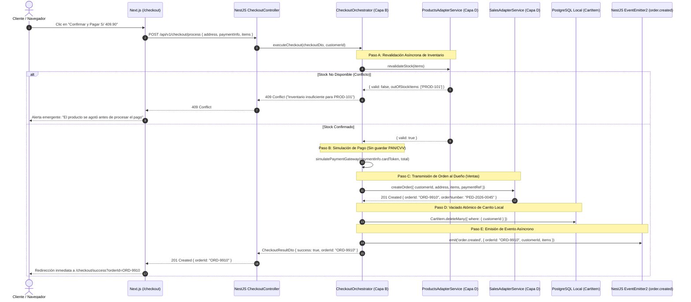

# SPEC-05: Transacción y Realización de Checkout (EP-TRX)
## Software Design Document (SDD) — Canal Marketplace

---

## 0. Metadatos y Control del Documento

| Atributo | Detalle |
| :--- | :--- |
| **Código del SPEC** | `SPEC-05` |
| **Épica Asociada** | `EP-TRX` — Transacción y Realización de Checkout |
| **Puntos de Historia (PH)** | **13 PH** (`HU-TRX-DIR`: 3 PH, `HU-TRX-PAG`: 5 PH, `HU-TRX-ORD`: 5 PH) |
| **Prioridad Global** | **Crítica (Flujo Transaccional)** |
| **Responsable Técnico** | **Giuliano** (UX/UI / Orquestación Checkout) |
| **Estado** | **Listo para Implementación (Approved)** |
| **Versión** | `1.0.0` |

---

## 1. Alcance Funcional y Requisitos BDD

### 1.1. Contexto y Visión de la Épica
El módulo de Checkout multipaso materializa la conversión económica en el Marketplace. Guía al cliente a través de la captura estricta de su dirección de despacho, calcula fletes de envío, ejecuta la revalidación de inventario inmediatamente antes del cobro, procesa la simulación segura de pagos con tarjeta (cumpliendo con directivas PCI-DSS sin retención local de datos sensibles) y coordina la transmisión de la orden aprobada hacia el Módulo de Ventas y Postventa.

### 1.2. Reglas de Negocio Aplicables (`RN-GEN-05`)
1. **Completitud de Dirección:** Todos los campos de envío (calle, número, departamento/provincia/distrito y teléfono de contacto) son obligatorios.
2. **Desglose Transparente:** La vista de pago exhibe con claridad meridiana: `Subtotal de Ítems` + `Costo de Envío` = `Total a Pagar`.
3. **Revalidación Asíncrona Pre-Pago:** Justo antes de ejecutar el cobro de la tarjeta, el orquestador verifica en tiempo real con el Módulo de Productos que el stock siga disponible.
4. **Protección de Datos Financieros:** Queda estrictamente prohibido persistir o registrar en bases de datos locales el número de tarjeta (PAN), fecha de expiración o código CVV (RNF-SEG-02).
5. **Empaquetado de Orden a Ventas:** El Marketplace no es dueño de la orden; empaqueta el pedido aprobado y lo remite vía API al Módulo de Ventas y Postventa.
6. **Vaciado Atómico del Carrito:** Una vez confirmada la orden por Ventas, el carrito activo del cliente debe purgarse inmediatamente.
7. **Disparo de Notificaciones:** Tras la confirmación, se emite el evento asíncrono interno `order.created` para el envío del correo de confirmación (`SPEC-07`).

---

### 1.3. Historias de Usuario y Escenarios Gherkin

#### `HU-TRX-DIR` — Captura de Datos de Envío (3 PH)
- **Como** comprador en checkout,
- **Quiero** ingresar o seleccionar mi dirección de entrega,
- **Para** asegurar que mis artículos deportivos lleguen al destino correcto.

```gherkin
Escenario: Ingreso válido de dirección de despacho
  Dado que el cliente se encuentra en el Paso 1 del Checkout,
  Cuando ingresa una dirección completa con calle, distrito, departamento y teléfono,
  Y presiona "Continuar al Pago",
  Entonces el sistema valida los campos, almacena temporalmente la dirección,
  Y avanza al Paso 2 de Pago.

Escenario: Campos de dirección faltantes
  Dado que el cliente omite el distrito o teléfono en el formulario,
  Cuando intenta avanzar al pago,
  Entonces el sistema marca los campos incompletos en rojo,
  Y bloquea el avance al siguiente paso.
```

#### `HU-TRX-PAG` — Simulación de Pago y Revalidación de Stock (5 PH)
- **Como** comprador,
- **Quiero** pagar mi compra simulando una transacción con tarjeta,
- **Para** concretar la adquisición de mis artículos con total seguridad.

```gherkin
Escenario: Pago exitoso con tarjeta y stock confirmado
  Dado que el cliente está en el Paso 2 con stock de productos revalidado,
  Cuando ingresa datos de tarjeta válidos y presiona "Pagar Total",
  Entonces el sistema procesa la simulación de pago,
  Aprueba la transacción y avanza a la generación del pedido.

Escenario: Conflicto por falta de inventario pre-pago
  Dado que otro usuario compró las últimas unidades mientras el cliente completaba el checkout,
  Cuando el orquestador ejecuta la revalidación de stock antes del pago,
  Entonces el sistema detiene el cobro,
  Y muestra un mensaje de alerta solicitando ajustar los artículos en el carrito.
```

#### `HU-TRX-ORD` — Generación del Pedido y Envío a Ventas (5 PH)
- **Como** cliente que ha pagado su compra,
- **Quiero** recibir la confirmación de mi orden con su código de compra,
- **Para** tener el comprobante oficial de mi adquisición.

```gherkin
Escenario: Generación y confirmación oficial de orden
  Dado que el pago fue aprobado por la pasarela simulada,
  Cuando el backend empaqueta y envía la orden al Módulo de Ventas,
  Entonces Ventas retorna el código de orden generado (ej. "ORD-9910"),
  El sistema vacía el carrito del cliente,
  Y redirige a la pantalla de éxito con el resumen de la compra.
```

---

## 2. Diagrama de Secuencia del Flujo Crítico (Mermaid)

### Flujo Crítico: Orquestación Multipaso, Revalidación de Stock, Cobro y Emisión a Ventas



---

## 3. Diseño Técnico Frontend (Next.js 14 / React)

### 3.1. Arquitectura de Pantalla Multipaso
- `app/checkout/page.tsx`: Layout tipo Wizard con barra de progreso superior:
  - **Paso 1: Despacho:** Formulario de dirección y selección de método de envío.
  - **Paso 2: Pago:** Formulario de tarjeta de crédito/débito simulada con formato visual interactivo.
  - **Paso 3: Revisión:** Resumen final de ítems, dirección y desglose de cobro.
- `app/checkout/success/page.tsx`: Pantalla de confirmación con animación de check verde, código de orden, detalles del despacho y botón para ir a "Mis Pedidos".

### 3.2. Formularios y Esquemas Zod (`lib/validations/checkout.ts`)
```typescript
export const addressSchema = z.object({
  street: z.string().min(5, "Dirección demasiado corta"),
  department: z.string().min(2, "Seleccione un departamento"),
  province: z.string().min(2, "Seleccione una provincia"),
  district: z.string().min(2, "Seleccione un distrito"),
  phone: z.string().regex(/^[0-9]{9}$/, "Teléfono debe tener 9 dígitos"),
  notes: z.string().optional()
});

export const paymentSchema = z.object({
  cardNumber: z.string().regex(/^[0-9]{16}$/, "Tarjeta debe tener 16 dígitos"),
  cardHolder: z.string().min(3, "Nombre en tarjeta requerido"),
  expiryMonth: z.string().regex(/^(0[1-9]|1[0-2])$/, "Mes inválido"),
  expiryYear: z.string().regex(/^[2-3][0-9]$/, "Año inválido"),
  cvv: z.string().regex(/^[0-9]{3,4}$/, "CVV inválido")
});
```

---

## 4. Diseño Técnico Backend (NestJS)

### 4.1. Controlador y Orquestador
- `CheckoutController` (`@Controller('checkout')`):
  - `POST /api/v1/checkout/process`: Endpoint protegido con `AuthGuard` que invoca `CheckoutOrchestrator.executeCheckout()`.
- `CheckoutOrchestrator`: Servicio inyectable que encapsula el pipeline de 5 pasos (validar stock -> cobrar -> emitir orden a Ventas -> vaciar carrito -> emitir evento de correo).

### 4.2. DTO de Checkout
```typescript
export class ProcessCheckoutDto {
  @ValidateNested() @Type(() => ShippingAddressDto) shippingAddress: ShippingAddressDto;
  @ValidateNested() @Type(() => PaymentDetailsDto) payment: PaymentDetailsDto;
}
```

---

## 5. Persistencia y Contratos de Integración (Capa D)

### 5.1. Persistencia Local
- **Vaciado de Carrito:** Limpieza atómica mediante `prisma.cartItem.deleteMany({ where: { customerId } })`.
- **Cero Tablas de Órdenes:** Las órdenes de compra NO se guardan en el Marketplace; son propiedad de **Ventas y Postventa**.

### 5.2. Contratos de Mocks API (`axios-mock-adapter`)

#### Creación de Orden en Ventas y Postventa (`HU-TRX-ORD`)
- **Endpoint:** `POST /api/v1/sales/orders`
- **Request Payload:**
  ```json
  {
    "customerId": "CUST-8842",
    "customerEmail": "juan.perez@deportes.com",
    "shippingAddress": {
      "street": "Av. Benavides 1234, Dpto 402",
      "district": "Miraflores",
      "city": "Lima",
      "phone": "987654321"
    },
    "items": [
      {
        "productId": "PROD-101",
        "variantId": "VAR-901",
        "productName": "Zapatilla Running Nike Air Zoom Pegasus 40",
        "quantity": 1,
        "unitPrice": 389.90
      }
    ],
    "subtotal": 389.90,
    "shippingCost": 20.00,
    "totalAmount": 409.90,
    "paymentMethod": "CREDIT_CARD",
    "paymentReference": "SIM-PAY-998811"
  }
  ```
- **Response 201 Created (Éxito):**
  ```json
  {
    "statusCode": 201,
    "orderId": "ORD-9910",
    "orderNumber": "PED-2026-0045",
    "status": "CONFIRMED",
    "createdAt": "2026-09-21T10:30:00Z"
  }
  ```

---

## 6. Matriz de Excepciones y Requisitos No Funcionales (RNF)

| Escenario de Falla / Borde | Código HTTP | Acción del Sistema / Resiliencia |
| :--- | :---: | :--- |
| **Agotamiento de Stock Pre-Pago** | `409 Conflict` | Se cancela el cobro; se alerta al usuario qué ítems ya no tienen inventario. |
| **Tarjeta Denegada en Simulación** | `402 Payment Required` | Se muestra mensaje: "Tarjeta rechazada por fondos insuficientes o datos incorrectos". |
| **Fallo en Microservicio de Ventas**| `502 Bad Gateway` | Se activa compensación: no se vacía el carrito y se informa al cliente del reintento. |
| **Seguridad de Tarjetas (PCI-DSS)** | `RNF-SEG-02` | El backend descarta los datos de tarjeta inmediatamente tras la simulación; nunca se loguean. |

---

## 7. Plan de Verificación y Definition of Done (DoD)

### 7.1. Pruebas Requeridas
- **Unitarias:** Verificación de `CheckoutOrchestrator` simulando respuestas exitosas y de fallo en stock.
- **Integración:** Flujo end-to-end con `axios-mock-adapter` verificando emisión de orden y vaciado de carrito en BD PostgreSQL local.
- **E2E:** Flujo completo: Llenar formulario de dirección -> Simular pago -> Pantalla de felicitaciones con `orderId`.

### 7.2. Checklist de Definition of Done (Responsable: Giuliano)
- [ ] 100% de los 3 escenarios BDD de checkout ejecutados satisfactoriamente.
- [ ] Cero persistencia local de números de tarjeta de crédito (verificado en código e inspección de BD).
- [ ] Vaciado verificado del carrito local tras el pago exitoso.
- [ ] Emisión probada del evento `order.created` hacia el sistema de eventos.
