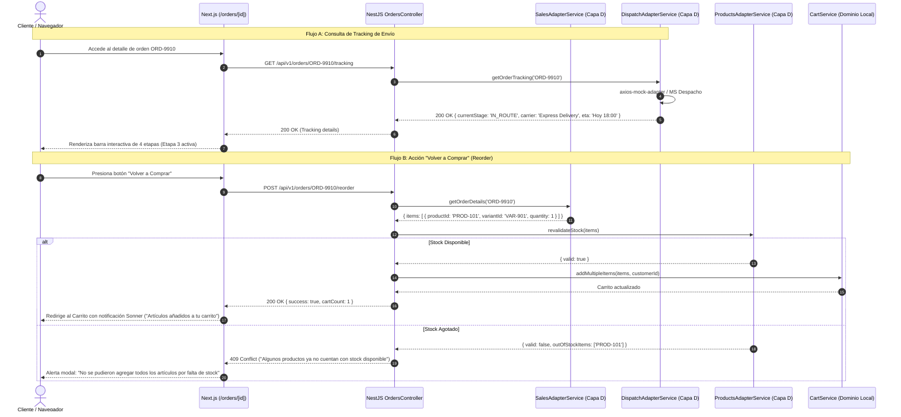

# SPEC-06: Seguimiento e Historial de Pedidos (EP-SHP)
## Software Design Document (SDD) — Canal Marketplace

---

## 0. Metadatos y Control del Documento

| Atributo | Detalle |
| :--- | :--- |
| **Código del SPEC** | `SPEC-06` |
| **Épica Asociada** | `EP-SHP` — Seguimiento e Historial de Pedidos |
| **Puntos de Historia (PH)** | **11 PH** (`HU-SHP-HIS`: 3 PH, `HU-SHP-DET`: 3 PH, `HU-SHP-TRK`: 5 PH) |
| **Prioridad Global** | **Alta (Postventa y Fidelización)** |
| **Responsable Técnico** | **Diego** (JP / QA) |
| **Estado** | **Listo para Implementación (Approved)** |
| **Versión** | `1.0.0` |

---

## 1. Alcance Funcional y Requisitos BDD

### 1.1. Contexto y Visión de la Épica
El módulo de Postventa y Seguimiento actúa como un visor de lectura inteligente para el cliente autenticado. Conecta de forma desacoplada con el Módulo de Ventas y Postventa (para consultar el historial de órdenes y detalle de facturación) y con el Módulo de Despacho y Entrega a Domicilio (para renderizar la línea de tiempo y progreso del envío en ruta). Además, incluye la función de "Volver a Comprar" (*Reorder*) con revalidación automática de inventario.

### 1.2. Reglas de Negocio Aplicables (`RN-GEN-06`)
1. **Rol de Visor de Lectura:** El Marketplace no almacena pedidos ni despachos; consume las APIs oficiales de Ventas y Despacho.
2. **Orden Cronológico y Filtros:** El historial presenta las compras ordenadas de la más reciente a la más antigua, con filtros rápidos por estado: `"TODOS"`, `"EN_PROCESO"`, `"ENTREGADO"`, `"CANCELADO"`.
3. **Ficha Completa de Pedido:** La vista de detalle expone imágenes de los artículos, variantes, precios unitarios pagados, método de pago y dirección de despacho.
4. **Revalidación en Reordenado (*Reorder*):** La acción "Volver a Comprar" consulta asíncronamente el stock actual con el Módulo de Productos antes de transferir los ítems al carrito local.
5. **Barra de Seguimiento de 4 Etapas:** El tracking visual refleja secuencialmente las fases oficiales de Despacho:
   `1. Pedido Registrado` ➔ `2. En Preparación (Almacén)` ➔ `3. En Ruta de Entrega` ➔ `4. Entregado al Cliente`.

---

### 1.3. Historias de Usuario y Escenarios Gherkin

#### `HU-SHP-HIS` — Historial de Pedidos y Filtros (3 PH)
- **Como** cliente autenticado,
- **Quiero** ver la lista de todas mis compras anteriores y filtrarlas por estado,
- **Para** llevar el control de mis transacciones y consultar pedidos pasados.

```gherkin
Escenario: Consulta exitosa de historial de compras
  Dado que un cliente con sesión activa ingresa a la sección "Mis Pedidos",
  Cuando el sistema consulta el historial con el Módulo de Ventas,
  Entonces despliega las órdenes ordenadas cronológicamente,
  Mostrando código de orden, fecha, número de artículos, total pagado y estado.

Escenario: Filtrado dinámico por estado de pedido
  Dado que el cliente visualiza su historial con pedidos en diferentes etapas,
  Cuando selecciona el filtro "En Proceso",
  Entonces la lista se actualiza mostrando únicamente las órdenes activas pendientes de entrega.
```

#### `HU-SHP-DET` — Detalle de Pedido y Reordenado (3 PH)
- **Como** cliente registrado,
- **Quiero** consultar los detalles de una compra y volver a comprar los mismos artículos,
- **Para** repetir un pedido rápidamente sin buscar producto por producto.

```gherkin
Escenario: Visualización de la ficha de detalle de un pedido
  Dado que el cliente presiona "Ver Detalle" en una orden de su historial,
  Cuando carga la pantalla de detalle,
  Entonces muestra la lista de artículos con sus fotos y tallas,
  El desglose financiero exacto y los datos de envío.

Escenario: Reordenado exitoso de productos con stock disponible
  Dado que el cliente está en el detalle de un pedido anterior y presiona "Volver a Comprar",
  Cuando el sistema confirma que todos los productos cuentan con inventario vigente,
  Entonces los agrega al carrito de compras,
  Y redirige al cliente a la vista del carrito.
```

#### `HU-SHP-TRK` — Seguimiento en Tiempo Real del Envío (5 PH)
- **Como** comprador que espera su paquete,
- **Quiero** ver una barra visual de progreso con el estado del despacho,
- **Para** conocer en qué etapa se encuentra mi entrega y cuándo llegará.

```gherkin
Escenario: Seguimiento en ruta de un pedido activo
  Dado que el cliente consulta el tracking de una orden con despacho en curso,
  Cuando la API de Despacho responde con el estado "EN_RUTA",
  Entonces el sistema marca completadas las etapas 1 y 2,
  Y resalta la etapa 3 "En Ruta" indicando fecha estimada de llegada y nombre del repartidor.
```

---

## 2. Diagrama de Secuencia del Flujo Crítico (Mermaid)

### Flujo Crítico: Consulta de Tracking y Reordenado (*Reorder*) con Revalidación de Stock



---

## 3. Diseño Técnico Frontend (Next.js 14 / React)

### 3.1. Rutas y Componentes
- `app/orders/page.tsx`: Bandeja de compras del cliente con tabs de filtrado (`shadcn/ui` Tabs).
- `app/orders/[id]/page.tsx`: Ficha detallada de compra y visor de entrega.
- `components/orders/OrderCard.tsx`: Tarjeta resumen de pedido (fecha, badge de estado, miniaturas y botón "Ver Pedido").
- `components/orders/TrackingTimeline.tsx`: Barra horizontal de progreso en 4 pasos con íconos de Lucide (`PackageCheck`, `Warehouse`, `Truck`, `Home`).
- `components/orders/ReorderButton.tsx`: Botón de acción con spinner de carga durante la revalidación.

---

## 4. Diseño Técnico Backend (NestJS)

### 4.1. Controlador REST (`OrdersController`)
- **Ruta Base:** `@Controller('orders')` (Protegido con `AuthGuard`)
- **Endpoints:**
  - `GET /api/v1/orders` — Consulta historial de compras filtrado por `status` y paginado.
  - `GET /api/v1/orders/:orderId` — Consulta detalle completo de la orden desde Ventas.
  - `GET /api/v1/orders/:orderId/tracking` — Consulta el estado del paquete desde Despacho.
  - `POST /api/v1/orders/:orderId/reorder` — Revalida stock e inserta ítems al carrito local.

---

## 5. Persistencia y Contratos de Integración (Capa D)

### 5.1. Persistencia Local
> [!IMPORTANT]
> **Cero Persistencia Local:** Este módulo opera puramente como agregador y visor. El Marketplace no crea tablas para pedidos ni despachos.

### 5.2. Contratos de Mocks API (`axios-mock-adapter`)

#### A. Historial de Pedidos en Ventas (`HU-SHP-HIS`)
- **Endpoint:** `GET /api/v1/sales/orders?customerId=CUST-8842`
- **Response 200 OK:**
  ```json
  [
    {
      "orderId": "ORD-9910",
      "orderNumber": "PED-2026-0045",
      "createdAt": "2026-09-21T10:30:00Z",
      "status": "IN_PREPARATION",
      "totalAmount": 409.90,
      "itemsCount": 1,
      "items": [
        {
          "productId": "PROD-101",
          "name": "Zapatilla Running Nike Air Zoom Pegasus 40",
          "variant": "Talla: 42, Color: Negro",
          "quantity": 1,
          "unitPrice": 389.90,
          "thumbnail": "https://images.unsplash.com/photo-1542291026-7eec264c27ff"
        }
      ]
    }
  ]
  ```

#### B. Tracking en Despacho (`HU-SHP-TRK`)
- **Endpoint:** `GET /api/v1/dispatch/tracking/ORD-9910`
- **Response 200 OK:**
  ```json
  {
    "orderId": "ORD-9910",
    "trackingNumber": "TRK-PE-884422",
    "carrier": "Servicio Express Deportivo",
    "estimatedDelivery": "2026-09-22T18:00:00Z",
    "currentStage": "IN_ROUTE",
    "stages": [
      { "id": 1, "name": "Pedido Registrado", "completed": true, "timestamp": "2026-09-21T10:30:00Z" },
      { "id": 2, "name": "En Preparación", "completed": true, "timestamp": "2026-09-21T12:00:00Z" },
      { "id": 3, "name": "En Ruta", "completed": true, "timestamp": "2026-09-21T15:30:00Z" },
      { "id": 4, "name": "Entregado", "completed": false, "timestamp": null }
    ]
  }
  ```

---

## 6. Matriz de Excepciones y Requisitos No Funcionales (RNF)

| Escenario de Falla / Borde | Código HTTP | Acción del Sistema / Resiliencia |
| :--- | :---: | :--- |
| **Cliente sin Compras Previas** | `200 OK` (`[]`) | Muestra estado visual vacío con botón "Ir a la Tienda" para explorar artículos. |
| **Despacho No Asignado Aún** | `200 OK` (etapa 1) | La barra de tracking se muestra en fase inicial informando preparación en almacén. |
| **Fallo en Microservicio de Despacho** | `503 Unavailable` | Fallback mostrando los datos conocidos de la orden sin bloquear el detalle. |
| **Producto de Reorder Agotado** | `409 Conflict` | Se informa al cliente qué artículo no cuenta con unidades, sin corromper el carrito. |

---

## 7. Plan de Verificación y Definition of Done (DoD)

### 7.1. Pruebas Requeridas
- **Unitarias:** Renderizado condicional de las 4 etapas de la línea de tiempo de tracking.
- **Integración:** Pruebas contra `SalesAdapter` y `DispatchAdapter` mediante `axios-mock-adapter`.
- **E2E:** Ingreso a "Mis Pedidos" -> Visualización de tarjeta -> Entrada a detalle y verificación de barra de progreso.

### 7.2. Checklist de Definition of Done (Responsable: Diego)
- [ ] 100% de los 3 escenarios BDD de seguimiento e historial validados en Gherkin.
- [ ] Barra visual de tracking 100% adaptativa en dispositivos móviles.
- [ ] Función de "Volver a Comprar" verificada contra la API de stock.
- [ ] Cero almacenamiento local de órdenes o despachos en base de datos.
