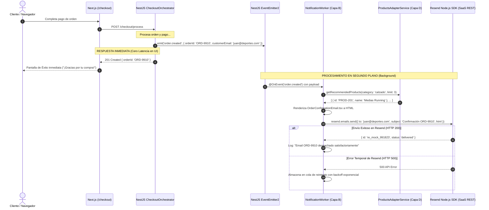

# SPEC-07: Sistema de Notificaciones por Correo del Pedido (EP-SNT)
## Software Design Document (SDD) — Canal Marketplace

---

## 0. Metadatos y Control del Documento

| Atributo | Detalle |
| :--- | :--- |
| **Código del SPEC** | `SPEC-07` |
| **Épica Asociada** | `EP-SNT` — Sistema de Notificaciones por Correo del Pedido al Cliente |
| **Puntos de Historia (PH)** | **13 PH** (`HU-SNT-TMP`: 3 PH, `HU-SNT-EML`: 5 PH, `HU-SNT-DES`: 5 PH) |
| **Prioridad Global** | **Alta (Comunicación Transaccional)** |
| **Responsable Técnico** | **Saire** (QA / Cloud) |
| **Estado** | **Listo para Implementación (Approved)** |
| **Versión** | `1.0.0` |

---

## 1. Alcance Funcional y Requisitos BDD

### 1.1. Contexto y Visión de la Épica
El sistema de notificaciones proporciona la comunicación oficial post-transacción al cliente mediante correos electrónicos transaccionales. Diseñado con **React Email** y despachado de forma asíncrona y no bloqueante mediante el **SDK de Resend**, asegura que el cliente reciba de inmediato su comprobante de compra con recomendaciones comerciales personalizadas, así como alertas automáticas cuando su paquete cambie de estado en la ruta de despacho.

### 1.2. Reglas de Negocio Aplicables (`RN-GEN-07`)
1. **Plantillas HTML Responsivas:** Los correos se construyen mediante componentes tipados en React Email (`.tsx`), garantizando legibilidad en clientes como Gmail, Apple Mail y Outlook móvil/desktop.
2. **Contenido de Confirmación Obligatorio:** El correo de orden debe detallar el código de compra, lista de productos (foto, variante, precio), subtotales, método de pago, dirección de entrega y un bloque de recomendación de productos complementarios del catálogo.
3. **Desacoplamiento y Asincronismo Total:** El procesamiento y despacho de emails se ejecuta en segundo plano (*Background Worker*) mediante eventos internos (`order.created`, `dispatch.updated`), sin demorar jamás la respuesta HTTP al cliente (RNF-PER-03).
4. **Notificaciones de Seguimiento de Despacho:** Al cambiar el estado del envío a "En Ruta" o "Entregado", el sistema envía un correo informativo con el botón directo de tracking.
5. **Aislamiento de Infraestructura de Correo:** El Marketplace delega el transporte y entrega a la API SaaS de Resend, manteniendo cero servidores SMTP propios.

---

### 1.3. Historias de Usuario y Escenarios Gherkin

#### `HU-SNT-TMP` — Diseño de Plantillas de Correo y Recomendaciones (3 PH)
- **Como** cliente comprador,
- **Quiero** recibir un correo de diseño profesional, claro y con productos recomendados,
- **Para** verificar mi compra y descubrir artículos que combinen con mis productos.

```gherkin
Escenario: Renderizado responsivo de plantilla de correo
  Dado que el sistema genera el contenido de una notificación de compra,
  Cuando compila la plantilla con los datos del pedido,
  Entonces el correo muestra el resumen financiero, los datos de despacho,
  Y una sección inferior con 3 artículos sugeridos del catálogo deportivo.
```

#### `HU-SNT-EML` — Envío Automático y Asíncrono de Confirmación (5 PH)
- **Como** comprador que finalizó su pago,
- **Quiero** recibir automáticamente un correo de confirmación en mi bandeja,
- **Para** tener el respaldo digital de mi transacción sin esperas en la web.

```gherkin
Escenario: Disparo y recepción de correo de orden creada
  Dado que un cliente completa exitosamente el pago de su orden (EP-TRX),
  Cuando el orquestador emite el evento interno 'order.created',
  Entonces el worker de notificaciones toma el evento asíncronamente,
  Y despacha el correo transaccional vía Resend en menos de 5 segundos.

Escenario: Falla temporal en el proveedor de correos
  Dado que el servicio de Resend experimenta una indisponibilidad momentánea,
  Cuando el worker intenta enviar la notificación,
  Entonces el sistema registra el incidente en logs y programa un reintento automático,
  Sin afectar ni bloquear la navegación del cliente en la tienda.
```

#### `HU-SNT-DES` — Notificación por Correo de Estado de Despacho (5 PH)
- **Como** comprador que espera su pedido,
- **Quiero** recibir avisos por correo cada vez que mi envío avance de fase,
- **Para** estar al tanto de la entrega y coordinar la recepción en mi domicilio.

```gherkin
Escenario: Notificación de paquete en ruta
  Dado que el Módulo de Despacho actualiza el estado de la orden a "EN_RUTA",
  Cuando el evento 'dispatch.updated' llega al Marketplace,
  Entonces el sistema envía un correo al cliente con el aviso de que su pedido está en camino,
  Incluyendo la fecha estimada y el botón de seguimiento en vivo.
```

---

## 2. Diagrama de Secuencia del Flujo Crítico (Mermaid)

### Flujo Crítico: Despacho Asíncrono de Confirmación de Compra sin Bloqueo de UI



---

## 3. Diseño Técnico de Plantillas (React Email / Next.js)

### 3.1. Arquitectura de Plantillas (`emails/`)
- `emails/OrderConfirmationEmail.tsx`: Plantilla principal con cabecera deportiva, detalles de compra, desglose de precios y bloque de recomendaciones.
- `emails/DispatchStatusEmail.tsx`: Plantilla de actualización de envío con barra visual de etapas e indicaciones de entrega.
- `emails/components/EmailHeader.tsx`: Logotipo del Marketplace y saludo personalizado.
- `emails/components/OrderItemsTable.tsx`: Tabla tipada con fotos de artículos, variantes, cantidades y precios.
- `emails/components/RecommendationsGrid.tsx`: Cuadrícula con 3 sugerencias cruzadas y enlaces directos a la tienda.

### 3.2. Estructura de Componente React Email
```tsx
import { Html, Head, Body, Container, Section, Text, Img, Button, Row, Column } from '@react-email/components';

export const OrderConfirmationEmail = ({ order, recommendations }) => (
  <Html>
    <Head />
    <Body style={{ fontFamily: 'sans-serif', backgroundColor: '#f4f4f5' }}>
      <Container style={{ maxWidth: '600px', backgroundColor: '#ffffff', padding: '24px' }}>
        <Text style={{ fontSize: '24px', fontWeight: 'bold' }}>¡Gracias por tu compra, {order.customerName}!</Text>
        <Text>Tu pedido <strong>{order.orderNumber}</strong> ha sido confirmado y se encuentra en preparación.</Text>
        {/* Tabla de ítems */}
        <Section>
          <Text style={{ fontWeight: 'bold', fontSize: '18px' }}>Productos que podrían gustarte:</Text>
          {/* Bloque de recomendaciones */}
        </Section>
      </Container>
    </Body>
  </Html>
);
```

---

## 4. Diseño Técnico Backend (NestJS)

### 4.1. Módulo y Worker de Notificaciones
- `NotificationModule`: Importa `ConfigModule`, `HttpModule` y expone `NotificationWorker`.
- `NotificationWorker` (`@Injectable()`):
  - Escucha eventos con decoradores `@OnEvent('order.created', { async: true })` y `@OnEvent('dispatch.updated', { async: true })`.
  - Inyecta `ConfigService` para obtener `RESEND_API_KEY` y `USE_MOCKS`.

### 4.2. Implementación del Event Listener
```typescript
@Injectable()
export class NotificationWorker {
  constructor(
    private readonly configService: ConfigService,
    private readonly productsAdapter: ProductsAdapterService,
  ) {}

  @OnEvent('order.created', { async: true })
  async handleOrderCreatedEvent(payload: OrderCreatedEvent) {
    const recommendations = await this.productsAdapter.getRecommendations(payload.category);
    await this.sendConfirmationEmail(payload, recommendations);
  }
}
```

---

## 5. Persistencia y Contratos de Integración (Capa D)

### 5.1. Persistencia Local
> [!IMPORTANT]
> **Cero Persistencia Local:** El Marketplace no almacena registros de auditoría de correos en tablas relacionales locales. Las métricas de entrega, aperturas y clics son administradas por el Dashboard SaaS de Resend.

### 5.2. Contratos de Mocks API (`Resend SDK Mock`)
- Cuando `USE_MOCKS=true`, el cliente de Resend es interceptado por un proveedor simulado (`MockEmailProvider`):
  ```json
  {
    "id": "re_mock_773322",
    "from": "Marketplace Deportivo <ventas@marketplace.com>",
    "to": "juan.perez@deportes.com",
    "subject": "¡Confirmación de tu Compra! Pedido #PED-2026-0045",
    "status": "QUEUED",
    "createdAt": "2026-09-21T10:30:02Z"
  }
  ```

---

## 6. Matriz de Excepciones y Requisitos No Funcionales (RNF)

| Escenario de Falla / Borde | Código / Estado | Acción del Sistema / Resiliencia |
| :--- | :---: | :--- |
| **Tiempo de Respuesta al Cliente** | `RNF-PER-03` | El evento es 100% asíncrono; tiempo de respuesta del checkout: < 800 ms. |
| **Falla de Conexión con Resend API** | `500 Resend Error` | Reintento automático con jitter y backoff exponencial (máx. 3 intentos). |
| **Rebote por Correo Inexistente** | `Webhook Bounce` | Se registra en logger de errores para auditoría interna sin detener el sistema. |
| **Seguridad de Claves de API** | `RNF-SEG-03` | `RESEND_API_KEY` inyectada exclusivamente desde variables de entorno seguras. |

---

## 7. Plan de Verificación y Definition of Done (DoD)

### 7.1. Pruebas Requeridas
- **Unitarias:** Verificación de compilación de plantillas React Email y sustitución correcta de variables de pedido.
- **Integración:** Emisión de evento `order.created` comprobando que el worker intercepta el evento e invoca al proveedor de correo.
- **Visuales / Compatibilidad:** Prueba de renderizado de la plantilla HTML en visores de escritorio y mobile.

### 7.2. Checklist de Definition of Done (Responsable: Saire)
- [ ] 100% de los 3 escenarios BDD de notificaciones validados en Gherkin.
- [ ] Plantillas React Email visualmente atractivas con bloque de recomendaciones deportivas.
- [ ] Despacho comprobado en modo asíncrono no bloqueante.
- [ ] Configuración unificada en variables de entorno y soporte de modo Mock.
