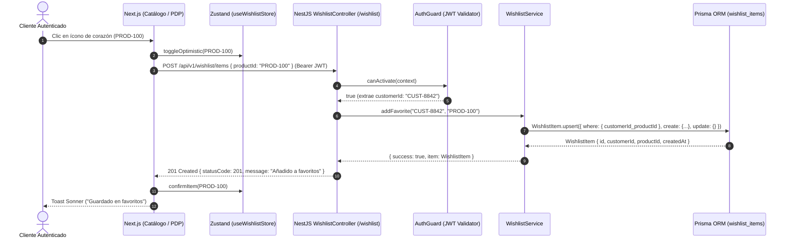
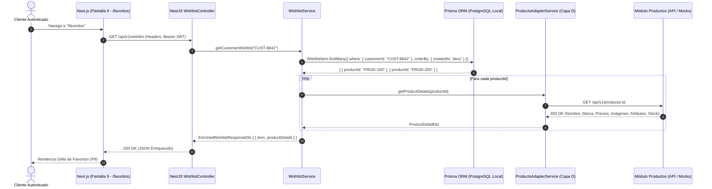
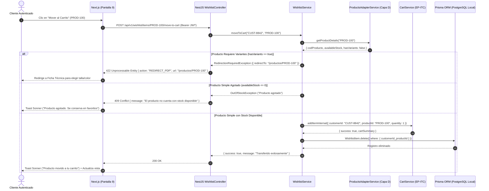

# SPEC-08: Gestión de Favoritos y Lista de Deseos (EP-FAV)
## Software Design Document (SDD) — Canal Marketplace

---

## 0. Metadatos y Control del Documento

| Atributo | Detalle |
| :--- | :--- |
| **Código del SPEC** | `SPEC-08` |
| **Épica Asociada** | `EP-FAV` — Gestión de Favoritos y Lista de Deseos |
| **Puntos de Historia (PH)** | **11 PH** (`HU-FAV-GUA`: 3 PH, `HU-FAV-GES`: 3 PH, `HU-FAV-CAR`: 5 PH) |
| **Prioridad Global** | **Media (Deseable / Conversión Diferida)** |
| **Responsable Técnico** | **Leonidas** (Arquitecto / Backend / Persistencia Relacional Local) |
| **Rol de Integración** | Integración con `CartService` (EP-ITC) y `ProductsAdapterService` (Capa D) |
| **Estado** | **Listo para Implementación (Approved)** |
| **Versión** | `1.0.0` |

---

## 1. Alcance Funcional y Requisitos BDD

### 1.1. Contexto y Visión de la Épica
La épica `EP-FAV` permite a los clientes registrados conservar productos de su interés en una lista de deseos personal, facilitando su consulta posterior, administración y eventual conversión de compra mediante la transferencia directa hacia el carrito de compras.

La arquitectura del sistema establece una separación estricta de responsabilidades:
- La lista de deseos persiste de forma **exclusiva y aislada** en la base de datos local del Marketplace bajo el modelo `WishlistItem` gestionado con **Prisma ORM (PostgreSQL 16)**.
- Se delega la identidad del cliente al **Módulo de Seguridad y Usuarios** a través de tokens JWT (`customerId`).
- Para transferir artículos al carrito, se consulta el stock en tiempo real mediante el **Módulo de Productos y Ofertas** y se delega la inserción y recálculo al `CartService` (`EP-ITC`), garantizando que **no se duplique la lógica de variantes, cantidades ni subtotales de la bolsa**.

---

### 1.2. Reglas de Negocio Aplicables (`RN-GEN-08`)

1. **Requerimiento Estricto de Autenticación (`RN-FAV-01`):** Guardar productos en favoritos exige una sesión autenticada con token JWT válido. Si un visitante no autenticado intenta guardar un producto, el sistema intercepta la acción y solicita inicio de sesión; tras autenticarse con éxito, retorna a la pantalla de origen y completa el guardado automáticamente.
2. **Aislamiento por Identidad del Cliente (`RN-FAV-02`):** Cada registro en favoritos se vincula exclusivamente al `customerId` extraído del token JWT validado en el backend. Un cliente jamás podrá consultar, modificar ni eliminar favoritos de otro cliente (prevención estricta de IDOR).
3. **Unicidad e Idempotencia (`RN-FAV-03`):** La combinación (`customerId`, `productId`) es única en la entidad `WishlistItem`. Si el cliente intenta agregar un producto ya existente en su lista, la operación se procesa de forma idempotente sin duplicar registros ni emitir errores bloqueantes.
4. **Independencia del Catálogo (`RN-FAV-04`):** Quitar un favorito de la lista remueve la asociación relacional en la base de datos local sin alterar ni eliminar el producto del catálogo general.
5. **Revalidación de Stock en Transferencia (`RN-FAV-05`):** Antes de mover un producto de favoritos al carrito, el backend consulta el inventario en tiempo real con el Módulo de Productos y Ofertas (`availableStock > 0`). Si el producto se encuentra agotado (`availableStock = 0`), la transferencia se bloquea, se notifica al usuario y el producto se conserva en favoritos.
6. **Manejo de Variantes (`RN-FAV-06`):** `WishlistItem` almacena el identificador base del producto (`productId`). 
   - Si el producto requiere selección de atributos obligatorios (talla o color), la acción "Mover al Carrito" redirige al cliente a la Ficha Técnica (Pantalla 7 - PDP) para completar la selección de variantes antes de añadirlo a la bolsa.
   - Si el producto es simple (sin variantes), se añade directamente a la bolsa de compras reutilizando `CartService`.
7. **Eliminación Condicionada al Éxito (`RN-FAV-07`):** Un producto transferido se retira de la tabla `WishlistItem` **únicamente si la adición a `CartItem` se completa con éxito** dentro de una transacción o flujo coordinado.

---

### 1.3. Historias de Usuario y Escenarios Gherkin

#### `HU-FAV-GUA` — Guardado de Productos en Favoritos (3 PH)
- **Como** cliente registrado del Marketplace,
- **Quiero** guardar productos desde el catálogo o la ficha de producto,
- **Para** conservar los artículos que me interesan y revisarlos más tarde.

```gherkin
Escenario 1: Guardado exitoso de un producto en favoritos
  Dado que un cliente autenticado visualiza un producto en el catálogo o ficha técnica,
  Cuando presiona el botón "Agregar a Favoritos" (ícono de corazón),
  Entonces el sistema registra el producto en la tabla local "WishlistItem" asociado a su ID de cliente,
  Y marca el ícono visualmente en estado activo (rojo/relleno) confirmando el guardado con una notificación emergente (Toast).

Escenario 2: Intento de guardado sin sesión activa
  Dado que un visitante no autenticado intenta presionar el botón "Agregar a Favoritos",
  Cuando el sistema detecta la ausencia de sesión activa (sin token JWT),
  Entonces abre el modal de inicio de sesión invitándolo a autenticarse,
  Y tras una autenticación exitosa, retorna a la pantalla de origen completando automáticamente el registro del producto en sus favoritos.

Escenario 3: Intento de guardado de producto ya existente (Idempotencia)
  Dado que un cliente ya tiene un producto guardado en su lista de favoritos,
  Cuando intenta presionar nuevamente "Agregar a Favoritos" sobre el mismo producto,
  Entonces el sistema mantiene la asociación única entre el cliente y el producto sin duplicar registros en la base de datos.
```

---

#### `HU-FAV-GES` — Consulta y Eliminación de Favoritos (3 PH)
- **Como** cliente registrado del Marketplace,
- **Quiero** consultar y eliminar productos de mi lista de deseos,
- **Para** mantener organizados mis artículos de interés.

```gherkin
Escenario 1: Consulta de la lista de favoritos
  Dado que un cliente autenticado tiene productos guardados en su lista de deseos,
  Cuando ingresa a la sección "Mis Favoritos" (Pantalla 9),
  Entonces el sistema consulta sus ítems en la base de datos local,
  Y presenta la grilla de productos con sus nombres, marcas, precios, ofertas y estado de stock enriquecidos desde el catálogo.

Escenario 2: Eliminación de un producto de favoritos
  Dado que un cliente visualiza su lista de favoritos en "Mis Favoritos",
  Cuando selecciona el botón o ícono "Quitar de Favoritos",
  Entonces el sistema elimina el registro correspondiente en la tabla "WishlistItem" de la base de datos local,
  Y actualiza la interfaz en tiempo real removiendo la tarjeta del producto sin recargar la página.
```

---

#### `HU-FAV-CAR` — Transferencia de Favoritos al Carrito (5 PH)
- **Como** cliente registrado del Marketplace,
- **Quiero** transferir un producto guardado en mis favoritos hacia el carrito de compras,
- **Para** iniciar su proceso de compra de manera ágil.

```gherkin
Escenario 1: Transferencia exitosa de producto simple con stock disponible
  Dado que un cliente autenticado consulta un producto simple sin variantes en "Mis Favoritos",
  Y dicho producto cuenta con stock disponible (> 0) en el Módulo de Productos,
  Cuando presiona el botón "Mover al Carrito",
  Entonces el sistema invoca al CartService para añadir el artículo a la bolsa de compras,
  Y tras la adición exitosa, remueve el artículo de la lista de favoritos y actualiza la vista.

Escenario 2: Intento de transferencia de producto agotado
  Dado que un cliente consulta un producto en "Mis Favoritos" cuyo stock disponible es igual a cero (0),
  Cuando presiona el botón "Mover al Carrito",
  Entonces el sistema bloquea la operación y despliega un mensaje notificando que el producto se encuentra agotado,
  Y mantiene intacto el producto en la lista de favoritos sin añadir nada al carrito.

Escenario 3: Transferencia de producto que requiere selección de variantes
  Dado que un cliente consulta un producto con variantes de talla o color en "Mis Favoritos",
  Cuando presiona el botón "Mover al Carrito",
  Entonces el sistema redirige al cliente a la Ficha Técnica del producto (Pantalla 7 - PDP) para que elija la variante deseada,
  Y mantiene el producto en la lista de favoritos hasta que la compra sea formalizada en la bolsa.
```

---

## 2. Diagramas de Secuencia Técnicos (Mermaid)

### 2.1. Flujo 1: Guardado Idempotente de Favorito (`HU-FAV-GUA`)



---

### 2.2. Flujo 2: Consulta Enriquecida de "Mis Favoritos" (`HU-FAV-GES`)



---

### 2.3. Flujo 3: Transferencia de Favorito a Carrito (`HU-FAV-CAR`)



---

## 3. Diseño Técnico Frontend (Next.js 14 / React)

### 3.1. Pantallas y Componentes Impactados
- **Pantalla 5: Home Comercial (`app/page.tsx`):** Ícono de corazón en tarjetas de productos destacados para guardado directo.
- **Pantalla 6: Catálogo de Productos (`app/catalogo/page.tsx`):** Botón flotante de favoritos en cada tarjeta de producto con estado reactivo.
- **Pantalla 7: Ficha Técnica del Producto (`app/productos/[id]/page.tsx`):** Botón principal "Guardar en Favoritos" junto al botón de compra.
- **Pantalla 9: Vista "Mis Favoritos" (`app/favoritos/page.tsx`):**
  - `components/wishlist/WishlistGrid.tsx`: Cuadrícula responsiva que presenta las tarjetas de artículos guardados.
  - `components/wishlist/WishlistItemCard.tsx`: Tarjeta con imagen, nombre, marca, precio regular/oferta, badge de disponibilidad ("Disponible" / "Agotado"), botón "Quitar de Favoritos" y botón "Mover al Carrito".
  - `components/wishlist/WishlistEmptyState.tsx`: Vista vacía cuando no existen ítems ("Aún no tienes favoritos") con botón "Explorar Catálogo".
  - `components/layout/NavbarFavoritesBadge.tsx`: Badge dinámico con contador de favoritos en el encabezado global.

### 3.2. Gestión de Estado Global y Cliente HTTP
- **Store en Zustand (`lib/stores/useWishlistStore.ts`):**
  ```typescript
  interface WishlistState {
    favoriteProductIds: Set<string>;
    itemsCount: number;
    setFavorites: (ids: string[]) => void;
    addFavoriteId: (id: string) => void;
    removeFavoriteId: (id: string) => void;
    isFavorite: (id: string) => boolean;
  }
  ```
- **Cliente HTTP con TanStack Query (`hooks/useWishlist.ts`):**
  - `useWishlistQuery()`: Ejecuta `GET /api/v1/wishlist`, almacena en caché y actualiza `useWishlistStore`.
  - `useAddFavoriteMutation()`: Ejecuta `POST /api/v1/wishlist/items` con optimismo visual.
  - `useRemoveFavoriteMutation()`: Ejecuta `DELETE /api/v1/wishlist/items/:id` con invalidación de caché.
  - `useMoveToCartMutation()`: Ejecuta `POST /api/v1/wishlist/items/:id/move-to-cart`, sincroniza Zustand del carrito y de favoritos simultáneamente.

---

## 4. Diseño Técnico Backend (NestJS)

### 4.1. Controlador REST (`WishlistController`)
- **Decorador Base:** `@Controller('wishlist')`
- **Seguridad:** Protegido con `@UseGuards(AuthGuard)` para garantizar la inyección de `req.user.customerId`.

| Método | Endpoint | DTO Entrada | Código HTTP | Descripción |
| :--- | :--- | :--- | :---: | :--- |
| `POST` | `/api/v1/wishlist/items` | `AddToWishlistDto` | `201 Created` | Registra un producto en favoritos de forma idempotente. |
| `GET` | `/api/v1/wishlist` | Ninguno (usa JWT) | `200 OK` | Obtiene los favoritos del cliente enriquecidos con datos del catálogo. |
| `DELETE` | `/api/v1/wishlist/items/:productId` | Param `productId` | `200 OK` | Elimina un producto de la lista de deseos. |
| `POST` | `/api/v1/wishlist/items/:productId/move-to-cart` | Param `productId` | `200 OK` | Revalida stock, añade al carrito y elimina de favoritos. |
| `GET` | `/api/v1/wishlist/check/:productId` | Param `productId` | `200 OK` | Devuelve `{ isFavorite: boolean }` para el renderizado del ícono. |

---

### 4.2. DTOs Tipados con `class-validator`

```typescript
import { IsString, IsNotEmpty, IsUUID } from 'class-validator';

export class AddToWishlistDto {
  @IsString()
  @IsNotEmpty({ message: 'El identificador del producto es requerido' })
  productId: string;
}

export class WishlistItemResponseDto {
  id: string;
  customerId: string;
  productId: string;
  createdAt: Date;
  product?: {
    nombre: string;
    marca: string;
    precioRegular: number;
    precioOferta?: number;
    descuentoPorcentaje?: number;
    imagenUrl: string;
    stockTotal: number;
    hasVariants: boolean;
  };
}

export class MoveToCartResponseDto {
  success: boolean;
  message: string;
  redirectUrl?: string;
}
```

---

### 4.3. Servicio de Dominio (`WishlistService`)

```typescript
@Injectable()
export class WishlistService {
  constructor(
    private readonly prisma: PrismaService,
    private readonly productsAdapter: ProductsAdapterService,
    private readonly cartService: CartService,
  ) {}

  async addFavorite(customerId: string, productId: string): Promise<WishlistItem> {
    return this.prisma.wishlistItem.upsert({
      where: { customerId_productId: { customerId, productId } },
      create: { customerId, productId },
      update: {}, // Idempotente
    });
  }

  async getWishlist(customerId: string): Promise<WishlistItemResponseDto[]> {
    const items = await this.prisma.wishlistItem.findMany({
      where: { customerId },
      orderBy: { createdAt: 'desc' },
    });

    return Promise.all(
      items.map(async (item) => {
        try {
          const product = await this.productsAdapter.getProductById(item.productId);
          return {
            ...item,
            product: {
              nombre: product.nombre,
              marca: product.marca,
              precioRegular: product.precioRegular,
              precioOferta: product.precioOferta,
              descuentoPorcentaje: product.descuentoPorcentaje,
              imagenUrl: product.imagenUrl || product.imagenes?.[0],
              stockTotal: product.stockTotal,
              hasVariants: (product.atributos && product.atributos.length > 0) || false,
            },
          };
        } catch {
          return { ...item, product: undefined };
        }
      }),
    );
  }

  async removeFavorite(customerId: string, productId: string): Promise<void> {
    await this.prisma.wishlistItem.deleteMany({
      where: { customerId, productId },
    });
  }

  async moveToCart(customerId: string, productId: string): Promise<MoveToCartResponseDto> {
    // 1. Validar producto y stock
    const product = await this.productsAdapter.getProductById(productId);
    if (!product) {
      throw new NotFoundException('El producto ya no se encuentra disponible');
    }

    // 2. Si requiere variantes, indicar redirección a PDP
    if (product.atributos && product.atributos.length > 0) {
      return {
        success: false,
        message: 'El producto requiere selección de variantes',
        redirectUrl: `/productos/${productId}`,
      };
    }

    // 3. Validar stock disponible
    const stockInfo = await this.productsAdapter.checkStock(productId);
    if (!stockInfo.isAvailable || stockInfo.availableStock <= 0) {
      throw new ConflictException('El producto se encuentra agotado actualmente');
    }

    // 4. Delegar adición a CartService (EP-ITC)
    await this.cartService.addItemForCustomer(customerId, {
      productId,
      quantity: 1,
      unitPrice: product.precioOferta || product.precioRegular,
    });

    // 5. Retirar de favoritos tras éxito confirmado
    await this.removeFavorite(customerId, productId);

    return {
      success: true,
      message: 'Producto añadido a la bolsa y retirado de favoritos',
    };
  }

  async isFavorite(customerId: string, productId: string): Promise<boolean> {
    const item = await this.prisma.wishlistItem.findUnique({
      where: { customerId_productId: { customerId, productId } },
    });
    return !!item;
  }
}
```

---

## 5. Persistencia y Capa de Adaptadores

### 5.1. Persistencia Relacional Local (Prisma ORM / PostgreSQL 16)
El modelo `WishlistItem` en `schema.prisma` rige la persistencia de favoritos:

```prisma
/// Lista de favoritos persistente asociada exclusivamente al ID del cliente
/// Épica: EP-FAV | Historias de Usuario: HU-FAV-GUA, HU-FAV-GES, HU-FAV-CAR
/// Responsable: Leonidas — Arquitecto / Backend (EP-FAV)
model WishlistItem {
  id         String   @id @default(uuid())
  customerId String   // ID del cliente autenticado (Módulo Seguridad)
  productId  String   // ID del producto guardado (Módulo Productos)
  createdAt  DateTime @default(now())

  @@unique([customerId, productId]) // Evita duplicar el mismo favorito por cliente
  @@index([customerId])              // Optimiza la consulta en "Mis Favoritos" (P9)
  @@map("wishlist_items")
}
```

- **Aislamiento:** Cero campos foráneos duros hacia microservicios externos (`customerId` y `productId` son strings referenciales).
- **Índices:** `@@index([customerId])` garantiza consultas inmediatas ($O(1)$) en Pantalla 9.
- **Unicidad:** `@@unique([customerId, productId])` garantiza integridad referencial a nivel de base de datos relacional.

---

### 5.2. Capa de Adaptadores (`ProductsAdapterService`)
`WishlistService` inyecta `ProductsAdapterService` para consumir los contratos de API del Módulo de Productos y Ofertas (o sus Mocks con `axios-mock-adapter` cuando `USE_MOCKS=true`):

1. **Detalle de Producto (`HU-DDP-FIC` / Sección 3.5 Contratos Mocks):**
   - `GET /api/v1/products/:id`
2. **Revalidación de Stock Positivo (`HU-DDP-STK` / Sección 3.6 Contratos Mocks):**
   - `GET /api/v1/products/:id/stock`
   - Respuesta esperada: `{ "codProducto": "PROD-100", "availableStock": 12, "isAvailable": true }`

---

## 6. Matriz de Excepciones y Requisitos No Funcionales (RNF)

### 6.1. Matriz de Respuestas y Excepciones HTTP

| Escenario de Falla / Borde | Código HTTP | Causa Técnica | Acción del Sistema / Resiliencia |
| :--- | :---: | :--- | :--- |
| **Petición sin Token JWT** | `401 Unauthorized` | Cliente anónimo intentando acceder a favoritos | Redirige automáticamente al login modal; retiene URL previa. |
| **Token Expirado o Alterado** | `401 Unauthorized` | Token JWT con firma no válida o caducada | `AuthGuard` deniega; Frontend purga token y pide relogin. |
| **Producto No Existente en Catálogo** | `404 Not Found` | ID referencial ya no existe en microservicio de Productos | Se omite de la grilla enriquecida o se marca como "Descontinuado". |
| **Producto Agotado al Transferir** | `409 Conflict` | `availableStock === 0` en Módulo de Productos | Bloquea inserción en carrito; preserva en favoritos con aviso Toast. |
| **Producto Requiere Variantes** | `422 Unprocessable` | El artículo tiene tallas o colores no definidos | Retorna `redirectUrl: "/productos/:id"` para selección guiada. |
| **Caída de BD Local PostgreSQL** | `500 Internal Server` | Error de conexión Prisma | Logger registra el incidente; mensaje amigable al cliente. |

---

### 6.2. Cumplimiento de Atributos de Calidad (RNF)

- **`RNF-SEC-01` (Autenticación Delegada):** Ningún endpoint de favoritos acepta contraseñas ni crea usuarios. El `customerId` proviene estrictamente del payload verificado por el `AuthGuard`.
- **`RNF-SEC-02` (Prevención de IDOR):** El backend no expone ningún endpoint donde el cliente envíe su `customerId` en la URL o cuerpo; siempre se utiliza el extraído del JWT verificado.
- **`RNF-PER-01` (Rendimiento en Consultas):** La consulta en `WishlistItem` utiliza el índice `customerId` y las llamadas concurrentes a `ProductsAdapterService` se resuelven mediante `Promise.all` en paralelo.
- **`RNF-DIS-01` (Aislamiento de Persistencia Local):** La tabla `wishlist_items` opera de manera 100% aislada en la base de datos PostgreSQL local del Marketplace.

---

## 7. Plan de Verificación y Definition of Done (DoD)

### 7.1. Suite de Pruebas Requeridas

#### A. Pruebas Unitarias (Jest / NestJS Testing)
- **`WishlistService.spec.ts`:**
  - Debe guardar un favorito exitosamente invocando `prisma.wishlistItem.upsert`.
  - Debe procesar el guardado repetido sin duplicar filas (idempotencia).
  - Debe consultar la lista de favoritos y enriquecer los datos mediante `ProductsAdapterService`.
  - Debe lanzar `ConflictException` si se intenta transferir al carrito un producto sin existencias.
  - Debe retornar `redirectUrl` cuando el producto a transferir requiera selección de variantes.
  - Debe llamar a `cartService.addItemForCustomer` y `removeFavorite` al mover un producto simple disponible.

#### B. Pruebas de Integración (Supertest + NestJS E2E Test)
- `POST /api/v1/wishlist/items`: Retorna `401` sin token; retorna `201` con token válido.
- `GET /api/v1/wishlist`: Retorna array de favoritos asociados al cliente del token.
- `DELETE /api/v1/wishlist/items/:id`: Retorna `200` y elimina el registro en la base de datos local.
- `POST /api/v1/wishlist/items/:id/move-to-cart`: Verifica la coordinación entre carrito y favoritos.

---

### 7.2. Checklist de Definition of Done (Responsable: Leonidas — Arquitecto / Backend)

- [ ] **Nivel 1 (Funcional y BDD):** 100% de los escenarios Gherkin de `HU-FAV-GUA`, `HU-FAV-GES` y `HU-FAV-CAR` pasando satisfactoriamente.
- [ ] **Nivel 2 (Arquitectura y Seguridad):** Persistencia exclusiva en modelo `WishlistItem` de Prisma ORM. Cero consultas directas a bases de datos ajenas. Verificación estricta de token JWT (`customerId`).
- [ ] **Nivel 3 (Integración de Servicios):** Comunicación desacoplada con `ProductsAdapterService` (Capa D) y reutilización de `CartService` (EP-ITC) sin dependencias circulares.
- [ ] **Nivel 4 (Calidad y CI/CD):** Pruebas unitarias de `WishlistService` y pruebas de integración de endpoints pasando en verde en GitHub Actions.
