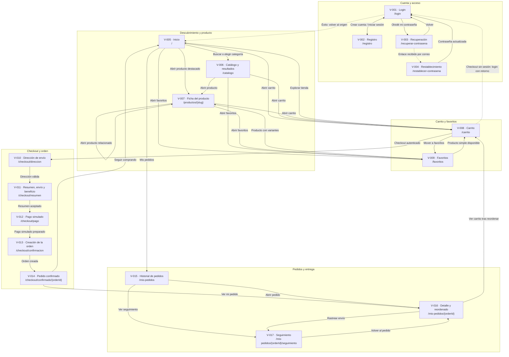
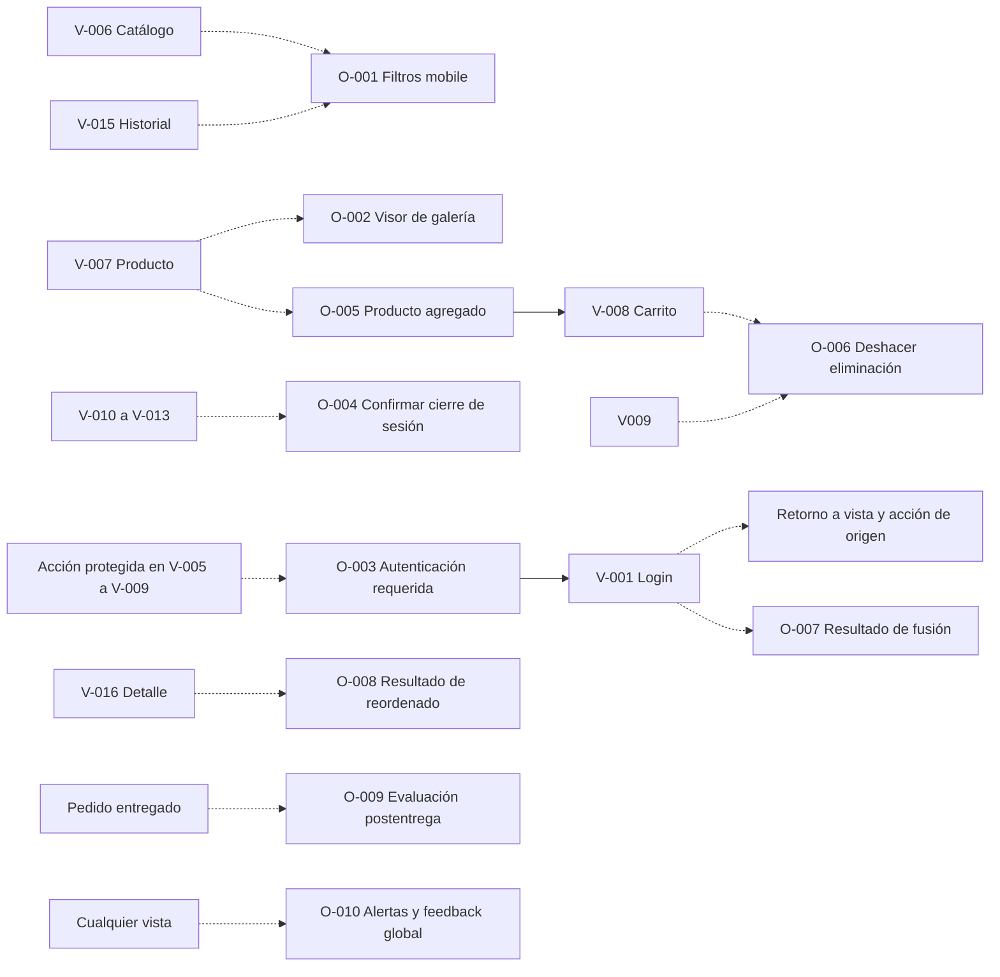
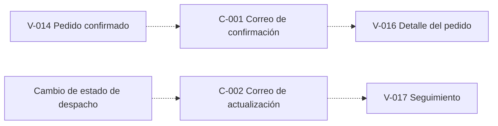

# Diagrama de navegación vigente del Marketplace

Este documento representa la navegación entre las 17 vistas vigentes y sus relaciones principales con overlays y comunicaciones. Los IDs y rutas proceden del [`catálogo de vistas`](../SPECS/ui/vistas/README.md); el comportamiento detallado continúa definido por las specs `F-001` a `F-040`.

## Convenciones

- Flecha continua: navegación entre rutas.
- Flecha punteada: apertura de overlay, retorno condicionado o comunicación externa.
- Los overlays no son rutas ni sustituyen a las vistas.
- La navegación posterior al login regresa al origen protegido o a la acción que solicitó autenticación.

## Navegación principal

## Overlays dentro del flujo

## Comunicaciones externas

## Reglas resueltas

1. Login, registro, recuperación y restablecimiento son vistas con ruta propia (`V-001` a `V-004`). `O-003` sólo explica la autenticación requerida y conserva el retorno.
2. El carrito es una vista completa (`V-008`), no un drawer.
3. El pago de `V-012` es una simulación explícita sin tarjeta, CVV ni iconografía de cobro real.
4. La preparación del pago (`V-012`), la creación de la orden (`V-013`) y la confirmación (`V-014`) son resultados distintos.
5. Reordenar agrega artículos disponibles al carrito mediante `O-008`; no confirma una compra.
6. Los correos se documentan como comunicaciones `C-###` y no como pantallas navegables.

## Pendientes que no cambian la arquitectura

- Confirmar el patrón visual final de la navegación global en desktop y mobile.
- Confirmar desde qué superficies exactas se ofrece la evaluación postentrega `O-009`.
- Completar en cada spec la conservación de filtros, scroll, carrito y ruta de retorno.
